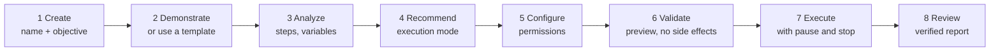
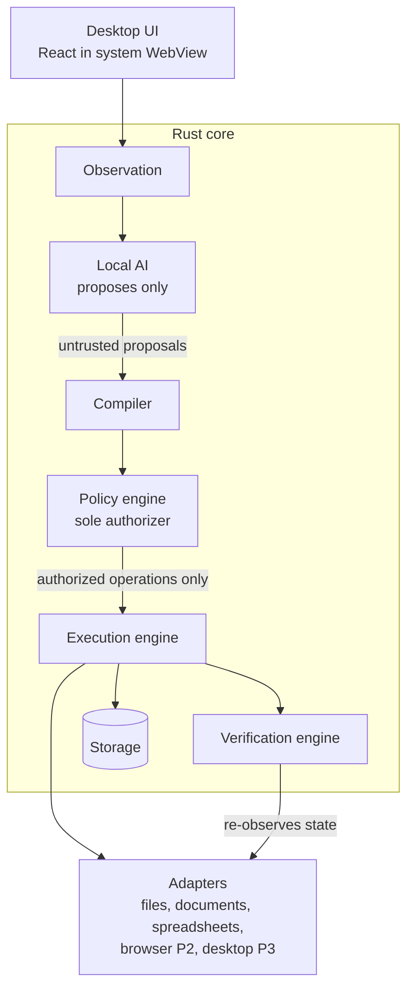

# LocalLoop

**An offline-first AI desktop workflow automation platform.**

> *Intelligence when necessary. Determinism whenever possible. User control always.*

> **Project status: pre-implementation.** This repository contains the product proposal, requirements, architecture, roadmap, a draft workflow schema, and documentation checks. **No application code exists yet.** Every capability below is planned, and performance figures are targets to be measured, not claims.

---

## Vision

LocalLoop turns repetitive computer work into reusable automations that a person can **demonstrate, inspect, and trust**, running entirely on their own laptop without cloud AI services. It uses local AI to *understand* work and reliable, deterministic automation to *execute* it ([proposal](docs/proposal/LocalLoop-Proposal.md)).

## The problem

People spend hours moving information between documents, spreadsheets, websites, and folders. Today's options each fall short in some way:

- **Macro and RPA tools** often need technical setup and break when an interface changes.
- **AI computer-use agents** reason continuously, which is slow, costly, often cloud-dependent, and hard to verify.
- **Cloud-dependent tools** stop working during outages or without internet, and send data off the device.

LocalLoop combines deterministic automation with local AI and lets the user decide how much intelligence each workflow needs.

## How it works



### Two execution modes

| | **Exact Replay** | **Adaptive Execution** |
|---|---|---|
| Best for | Stable, structured, repeatable tasks | Varying layouts, ambiguous inputs, context-dependent choices |
| Next action decided by | The approved workflow | The local model, **only among options the approved workflow declares** |
| AI needed at runtime | No (or data-only steps) | Yes, with fallback to the user |
| Recommended when | A deterministic version passes validation, however complex the workflow | Rules alone cannot reliably handle the variation |

LocalLoop recommends a mode with a plain-language explanation; the user can accept or override it, subject to a safety check.

## Core features (planned)

| Feature | Phase |
|---|---|
| Workflow library with versioning, export/import, and full pre-run inspection | MVP |
| Guided demonstration recording with explicit consent and redaction | MVP |
| Local-AI-assisted workflow creation (with a model-free fallback) | MVP (to be validated) |
| Smart Execution Mode Selection with explanations | MVP |
| Document pipeline: PDF/image intake, local OCR, extraction, validation, spreadsheet update, file organization, reports | MVP |
| Verification of every result; `completed` is never claimed without evidence | MVP |
| Permissions per workflow, human approval for consequential actions, emergency stop | MVP |
| Browser automation in a managed profile | Phase 2 (basic subset possibly in MVP) |
| Native desktop application automation via accessibility APIs, OCR, and optional local vision models | Phase 3 |
| Low-memory optimization, signed releases, offline updates, broader templates | Phase 4 |

## Proposed technology stack

| Concern | Proposed technology | Status |
|---|---|---|
| Desktop shell and UI | Tauri 2, React, TypeScript | Proposed |
| Core services | Rust | Proposed |
| Local storage | SQLite (WAL) + local files | Proposed |
| Local inference | llama.cpp server as an on-demand sidecar, GGUF models | Proposed, benchmark pending (EV-01) |
| Document parsing and OCR | Isolated Rust worker process; OCR engine to be chosen | Pending spike (EV-06) |
| Browser automation | Playwright via a Node.js bridge, Chrome DevTools Protocol | Proposed, packaging spike pending (EV-09) |
| Desktop automation | Windows UI Automation, macOS Accessibility API | Phase 3 |

Trade-offs and alternatives: [System Architecture §14](docs/architecture/SYSTEM_ARCHITECTURE.md#14-technology-evaluation).

## High-level architecture



The local model **never** authorizes anything. Its output is compiled into a closed set of operations and checked by the policy engine against the user's grants and approvals before any adapter acts.

## Repository structure

```text
LocalLoop/
├── .github/                    CI workflow, issue forms, PR template, Dependabot
├── docs/
│   ├── proposal/               Original product proposal (source of truth)
│   ├── requirements/           SRS, use cases, traceability matrix
│   ├── architecture/           System architecture, component design, data flow, security
│   ├── adr/                    Architecture decision records
│   └── development/            MVP scope, roadmap, backlog, setup
├── apps/desktop/               Tauri + React desktop app (planned)
├── crates/                     Rust workspace crates (planned)
│   ├── workflow-engine/        Domain model, compiler, planner, mode recommender
│   ├── policy-engine/          Permissions, scopes, taint, approvals
│   ├── execution-engine/       Run orchestration, journal, pause/stop, decisions
│   ├── verification-engine/    Postconditions, outcomes, recovery
│   ├── local-ai/               Model registry, inference sidecar, structured outputs
│   ├── observation/            Recording sessions and consent
│   ├── storage/                SQLite, journal, audit chain, evidence, backup
│   └── adapters/               files, documents, spreadsheet, browser (P2), desktop (P3)
├── sidecars/browser-bridge/    Playwright bridge process (Phase 2)
├── packages/shared/            Generated TypeScript types for IPC (planned)
├── schemas/workflow/0.1/       Draft workflow definition JSON Schema
├── examples/workflows/         Example workflows that validate against the schema
├── tests/                      Test strategy, fixtures, negative schema fixtures
└── scripts/                    Documentation and schema checks
```

## MVP scope

**Receive documents → Extract information → Validate data → Update a local spreadsheet → Organize files → Generate an execution report**, fully offline, useful without any AI model and better with a small local one. Details, limitations, and the demo script: [MVP_SCOPE.md](docs/development/MVP_SCOPE.md).

## Development status

| Area | State |
|---|---|
| Proposal | Complete (v1.0) |
| Requirements (SRS, use cases, traceability) | Draft 0.1 for review |
| Architecture, security architecture, ADRs | Draft 0.1, all ADRs *Proposed* |
| Workflow schema | Draft 0.1; validated against examples in CI |
| Application code | **Not started** (first milestone: M1.0) |
| Tests | Planned test cases only; documentation and schema checks run today |
| Licence | **Not chosen** — see [LICENSE_SELECTION.md](LICENSE_SELECTION.md) |

Decisions awaiting confirmation are listed in [SRS §18.4](docs/requirements/SRS.md#184-decisions-requiring-confirmation).

## Getting started

Today you can run the documentation checks:

```bash
python3 scripts/check_docs.py                     # IDs, traceability, links
python3 -m pip install -r scripts/requirements.txt
python3 scripts/validate_schemas.py               # schema + example workflows
```

Toolchain and the commands to begin implementation: [SETUP.md](docs/development/SETUP.md).

## Roadmap

| Phase | Focus | Gate |
|---|---|---|
| 1 — Core Automation Foundation | Model-free document automation end to end, then guided demonstration and the local AI slice | **MVP release** |
| 2 — Browser Automation and Workflow Intelligence | Browser recording and automation; adaptive browser workflows; productivity study | User validation |
| 3 — Desktop Vision and Application Support | Accessibility-based app automation; OCR/vision fallback | Per-app capability tests |
| 4 — Reliability, Optimization, Production Readiness | Low-memory tuning, templates, sandboxing, signing, offline updates | 1.0 release |

Phases advance on measured exit criteria, not dates. Full plan: [ROADMAP.md](docs/development/ROADMAP.md) · Issue-sized backlog: [BACKLOG.md](docs/development/BACKLOG.md).

## Documentation

| Document | Purpose |
|---|---|
| [SRS](docs/requirements/SRS.md) | What LocalLoop must do (120 functional, 36 non-functional requirements) |
| [Use cases](docs/requirements/use-cases.md) | How users interact with it |
| [Traceability](docs/requirements/requirements-traceability.md) | Objective → requirement → component → test → phase |
| [System Architecture](docs/architecture/SYSTEM_ARCHITECTURE.md) | How it is designed |
| [Component design](docs/architecture/component-design.md) | Modules, operation catalog, state machines, storage |
| [Data flow](docs/architecture/data-flow.md) | Data movement, taint, retention |
| [Security architecture](docs/architecture/security-architecture.md) | Threat model and controls |
| [ADRs](docs/adr/README.md) | Architecture decisions |

## Contributing

See [CONTRIBUTING.md](CONTRIBUTING.md). Please reference requirement IDs (for example `FR-063`) in issues and pull requests, and run `python3 scripts/check_docs.py` before opening a PR.

## Security

LocalLoop is designed so that AI output can never authorize an action. To report a vulnerability, see [SECURITY.md](SECURITY.md).

## Licence

No licence has been chosen yet; until one is added, all rights are reserved by the authors. See [LICENSE_SELECTION.md](LICENSE_SELECTION.md).
