# LocalLoop — System Architecture

| Field | Value |
|---|---|
| Document ID | LL-SAD |
| Version | 0.1 (draft for review) |
| Date | 2026-10-09 |
| Inputs | [Proposal v1.0](../proposal/LocalLoop-Proposal.md) (cited as **P§n**), [SRS](../requirements/SRS.md) |
| Companion documents | [Component design](component-design.md) · [Data flow](data-flow.md) · [Security architecture](security-architecture.md) · [ADRs](../adr/README.md) |

> **Status:** This document describes a *proposed* design. Nothing is implemented. Each technology choice is labelled **Proposed** (from the proposal, not yet confirmed), **Recommended** (this document's recommendation, pending an ADR or spike), or **Decided** (accepted ADR). As of this version, no choice is *Decided*.

The SRS says **what** LocalLoop must do. This document explains **how** LocalLoop is designed to do it.

---

## 1. Purpose and Scope

This document defines LocalLoop's structure: containers, components, interfaces, data, runtime behaviour, trust boundaries, deployment, and technology choices with their trade-offs. It covers all four roadmap phases, marking which parts the MVP needs (§16).

## 2. Architectural Drivers and Principles

### 2.1 Drivers

| Driver | Source | Architectural consequence |
|---|---|---|
| Offline-first, no cloud dependency | P§6, FR-114 | All components run on the device; no LocalLoop server; models and runtimes ship locally |
| AI proposes, never authorizes | P§5 Layer 4, P§15.6, C-01 | AI sits *outside* the trusted execution path; a compiler and policy engine sit between AI output and every adapter |
| Determinism whenever possible | P§1, C-05 | Exact Replay needs no model; mode recommendation is rule-based; inference is on-demand only |
| Verified outcomes | P§4.7, P§15.9 | Independent verification engine re-observes state; crash-safe journal |
| Ordinary 8 GB hardware | P§7, C-08 | Inference in a separate, unloadable process; Basic Automation never loads a model |
| Windows and macOS | P§1 | Platform abstraction layer under a shared core |
| Untrusted inputs everywhere | P§9 | Taint tracking; document parsing isolated in a worker process; prompts treat content as data |

### 2.2 Principles

1. **P1 — The model is an advisor, the policy engine is the gate.** Model output is data. Only the compiler and policy engine turn intent into executable operations.
2. **P2 — Cheapest reliable method first.** File API → structural inspection → OCR/CV → VLM (P§4.6).
3. **P3 — Closed world of operations.** Only catalog operations exist. There is no "run this command" operation (FR-104).
4. **P4 — Verify, don't assume.** Success is a verified postcondition, not an adapter return value (FR-085).
5. **P5 — Fail closed and visibly.** Unknown state → `unverified`; unclear permission → deny; uncertain decision → ask.
6. **P6 — Capabilities by construction.** Adapters accept only values that only the policy engine can create (§7.4).
7. **P7 — Local, minimal, deletable data.** Store only what the user needs to trust and audit a run; let them delete it.

---

## 3. System Context (C4 Level 1)

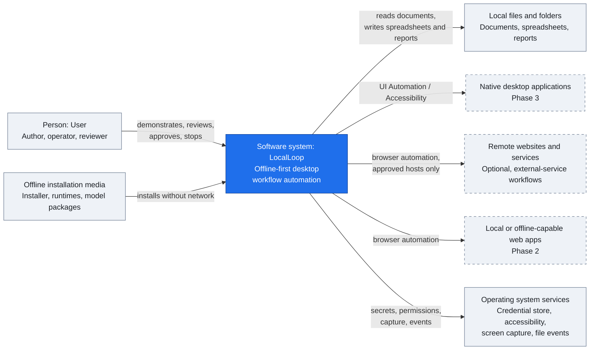

There is no LocalLoop cloud service. Remote websites appear only when a user's workflow targets them (P§6 "external-service-dependent workflows").

---

## 4. Containers (C4 Level 2)

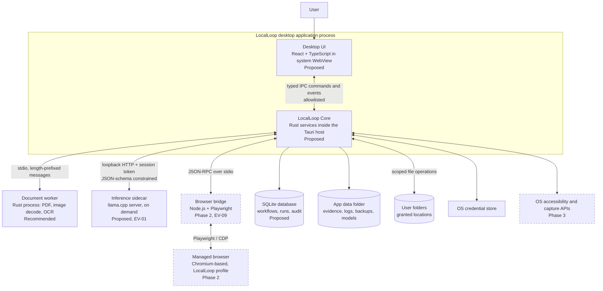

| Container | Responsibility | Technology | Release | Status |
|---|---|---|---|---|
| Desktop UI | Screens in [SRS §6.1](../requirements/SRS.md#61-user-interfaces); renders approvals and indicators | React + TypeScript, Vite, bundled fonts | MVP | Proposed (P§5 Layer 1) |
| LocalLoop Core | All domain logic: workflows, policy, execution, verification, storage, AI orchestration | Rust, Tauri 2 host, Tokio | MVP | Proposed |
| Document worker | Parse untrusted files (PDF, images), OCR; returns text with positions | Rust binary; PDF and OCR libraries (EV-06) | MVP | Recommended (ADR-0001) |
| Inference sidecar | Run local models with constrained decoding | llama.cpp `llama-server` | MVP | Proposed (EV-01, ADR-0003) |
| Browser bridge | Drive the managed browser; capture semantic snapshots | Node.js runtime + Playwright | P2 (D-02 deferral confirmed) | Recommended (EV-09, ADR-0004) |
| Managed browser | Execute browser steps in an isolated profile | Installed Edge/Chrome channel or bundled Chromium | P2 | Recommended |
| SQLite database | Durable state, journal, audit chain | SQLite in WAL mode | MVP | Proposed (P§5 Layer 7) |
| App data folder | Evidence, logs, backups, model files | File system | MVP | Proposed |

**Why separate processes:** the inference runtime can use several gigabytes and is unloaded by ending its process (FR-112); the document worker parses untrusted files, so a parser crash or exploit does not take down or directly compromise the core; the browser bridge needs a Node.js runtime that the Rust core should not embed.

---

## 5. Layered Architecture

The proposal's seven layers (P§5) map onto containers and code modules as follows.

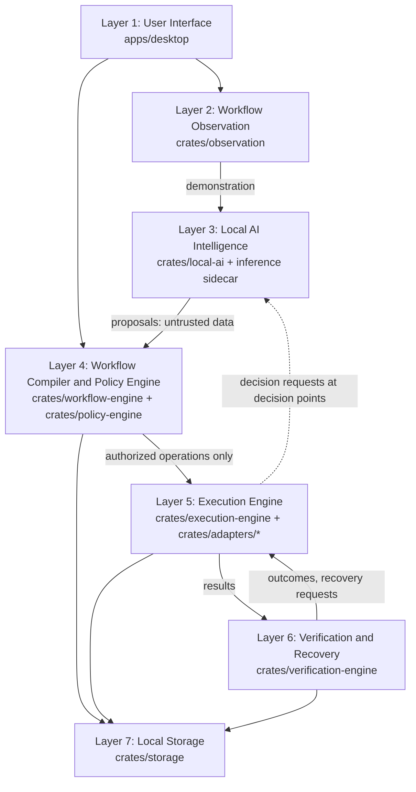

| Layer | Modules | Owns | Must not |
|---|---|---|---|
| 1 User Interface | `apps/desktop` (UI + Tauri commands) | Presentation, user intent, trusted approval rendering | Touch files, network, or models directly (NFR-014) |
| 2 Workflow Observation | `crates/observation` | Recording sessions, scope, consent, redaction | Execute operations |
| 3 Local AI Intelligence | `crates/local-ai`, inference sidecar | Model registry, prompts, structured outputs | Call adapters, policy, or storage of runs (NFR-030) |
| 4 Compiler and Policy | `crates/workflow-engine`, `crates/policy-engine` | Workflow model, compilation, planning, mode rules, permissions, approvals rules | Perform side effects |
| 5 Execution | `crates/execution-engine`, `crates/adapters/*` | Run orchestration, journal, adapters | Execute anything not authorized by layer 4 |
| 6 Verification and Recovery | `crates/verification-engine` | Postconditions, outcomes, recovery policy, rollback plans | Trust adapter self-reports |
| 7 Local Storage | `crates/storage` | Database, evidence, audit chain, backup | Hold secrets (they live in the OS store) |

---

## 6. Component Architecture

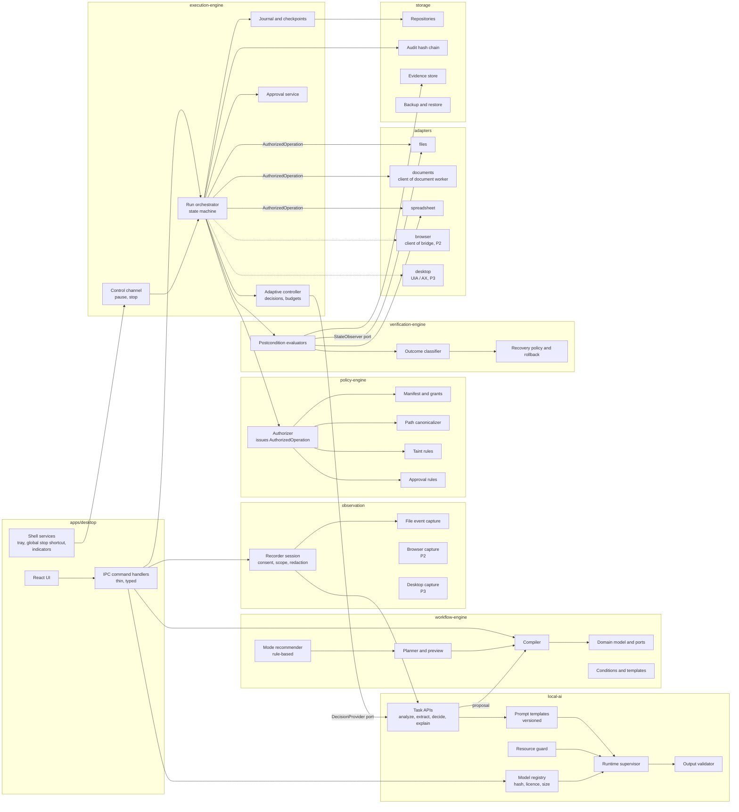

Detailed responsibilities, interfaces, and internal state machines are in [component-design.md](component-design.md).

### 6.1 Module dependency rules (NFR-030)

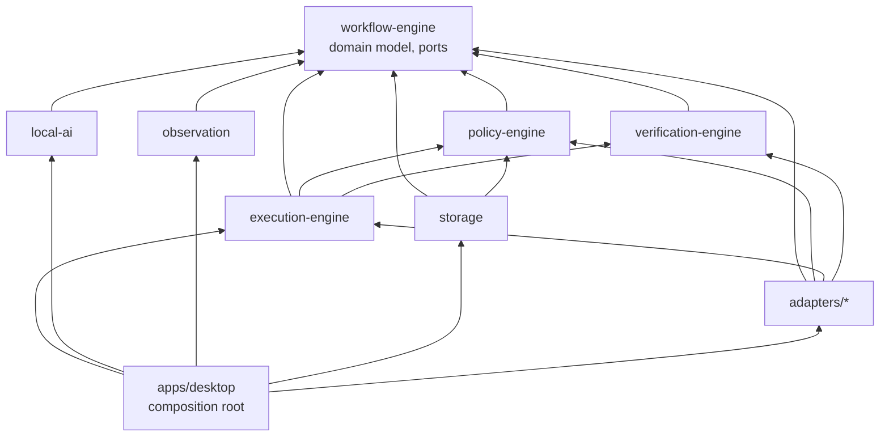

Forbidden dependencies, enforced in CI by `scripts/check_crate_deps.py` (direct or transitive, any dependency kind): `local-ai` → {`policy-engine`, `execution-engine`, `adapters/*`, `storage`}; `adapters/*` → `local-ai`; `observation` → {`execution-engine`, `adapters/*`}; `workflow-engine` → any internal crate. Only the desktop app composes everything. As a result, **the AI module cannot reach an adapter, even by mistake**, because it cannot name the types.

---

## 7. Layer Design

### 7.1 Layer 1 — User Interface

- **Responsibilities:** library, inspector, recorder, editor, recommendation panel, grant dialog, preview, run monitor, review queue, history, models, settings ([SRS §6.1](../requirements/SRS.md#61-user-interfaces)).
- **Trusted rendering:** approval dialogs, consent dialogs, and the emergency stop are rendered by LocalLoop's own UI from core data, never from document or web content. Text from untrusted sources is displayed as plain text, never as HTML.
- **IPC:** the UI calls a small allowlisted set of Tauri commands with typed arguments; the core emits events (`run.progress`, `approval.requested`, `decision.escalated`, `recording.state`). Types are generated from Rust definitions (Recommended: `specta`/`tauri-specta` or `ts-rs`) into `packages/shared`.
- **Hardening (Recommended):** Tauri capability files allow only the needed commands per window; strict Content Security Policy (`default-src 'self'`); no remote URLs loaded in app windows; Tauri's isolation pattern for IPC.
- **Shell services:** tray/menu-bar icon with stop; global stop shortcut (configurable; default to be chosen to avoid OS conflicts); always-visible run indicator (FR-098, FR-100).
- **Design system (Assumption):** headings and metrics in DM Sans, tables, forms, and body in Inter, on a fixed type scale (Display XL 36/40, H2 24/32, H3 18/28, H4/Body Large 16/24, Paragraph 14/20, uppercase labels 12/16 with 0.05em tracking). Fonts are bundled with the app, never fetched at runtime (FR-117).

### 7.2 Layer 2 — Workflow Observation

- **MVP (guided demonstration, A-03):** a recorder session with explicit scope (folders) and consent; file-event capture filtered to scope; in-app annotation of sample documents and spreadsheet mapping; review/redact before analysis (FR-015 to FR-022).
- **P2:** browser capture inside the managed profile via a recorder script injected by the bridge; captures semantic descriptors and never password values (FR-024).
- **P3:** desktop capture via UIA/AX event subscriptions limited to selected applications; keyboard capture limited to focused windows of selected applications; secure fields excluded (FR-025).
- **Output:** a `Demonstration` bundle (objective, ordered events, annotations, mappings, sample artifact references), stored locally and deletable (FR-027).

### 7.3 Layer 3 — Local AI Intelligence

- **Model registry:** records file path, SHA-256, size, licence, declared capability level, context length; verifies hash before load (FR-108).
- **Resource guard:** estimates memory needed (file size + context buffers) against available memory; refuses or downgrades (FR-113).
- **Runtime supervisor:** spawns the inference sidecar on demand bound to `127.0.0.1` on a random port with a per-session API key (or stdio), health-checks it, kills it after the idle timeout (FR-112), restarts it a bounded number of times (EXC-23).
- **Prompt templates:** versioned files, each declaring its task, input slots (trusted vs. untrusted), and output JSON schema. Untrusted slots are wrapped in clear delimiters and labelled as data (AIC-03).
- **Output validator:** parses JSON, validates against the task schema, then applies semantic checks (for example, decision `optionId` ∈ declared options). Invalid → reject (EXC-17).
- **Task APIs** (implement ports from `workflow-engine`): `analyze_demonstration`, `suggest_rules`, `extract_fields`, `decide`, `derive_mode_signals`, `explain`. None of them returns an executable operation; `analyze_demonstration` returns a *proposal* that must be compiled.

### 7.4 Layer 4 — Workflow Compiler and Policy Engine

**Compiler (`workflow-engine`).** Input: a proposal (from AI), an editor change set (from the user), or an imported file. Output: a workflow definition that (a) validates against the JSON Schema for its `schemaVersion`, (b) uses only catalog operations of the current release, (c) type-checks variables, conditions, and templates, (d) declares every location and host it touches, and (e) has success conditions and default postconditions. Anything else is rejected with located errors (FR-031). The compiler is a pure function, so it is deterministic and easy to test.

**Planner.** Expands a workflow version and concrete inputs into an *execution plan*: the ordered list of concrete operations per item, with parameters resolved. The plan is hashed (NFR-005) and drives both preview (FR-034) and plan approval (FR-099).

**Mode recommender.** Applies the ordered rules in [SRS §13.2](../requirements/SRS.md#132-recommendation-rules) to factor signals; returns recommendation + explanation template data. Rule-based by design (A-09, ADR-0001).

**Policy engine.** For each planned operation, evaluates in order:

1. Operation is in the release catalog and in the workflow's manifest.
2. Parameters pass type and range checks.
3. Every path canonicalizes inside a bound location with the needed access (FR-105).
4. Every host is in the allowlist (FR-074).
5. Taint rules: tainted values only in permitted parameter positions (FR-106; table in [security-architecture.md](security-architecture.md#6-prompt-injection-and-untrusted-content-defence)).
6. Mode rules: in Adaptive Execution, the operation is reachable from the chosen declared option.
7. Effect class and markings → approval requirement (SRS §9.4).

Result: `Allow(AuthorizedOperation)`, `RequireApproval(ApprovalRequest)`, or `Deny(Reason)`. **`AuthorizedOperation` has a private constructor inside `policy-engine`**, and adapters accept only that type. Therefore an adapter cannot be invoked with an operation that skipped policy, even through a programming error (P6). An approval, once granted, is exchanged for an `AuthorizedOperation` only if the operation's hash matches the approved hash (FR-099).

### 7.5 Layer 5 — Execution Engine

- **Run orchestrator:** a per-run state machine (component-design §4) that iterates items and steps, asks the policy engine before each operation, writes a journal *intent* before dispatch and a *result* after, and emits progress events.
- **Control channel:** pause and stop are checked before every dispatch; stop also cancels in-flight cancellable operations (adapters receive a cancellation token) (FR-097, FR-098).
- **Adaptive controller:** at decision points, calls the `DecisionProvider` port, runs consistency and precondition checks, escalates when needed, and enforces budgets (FR-047 to FR-051).
- **Approval service:** batches plan approvals, issues single-use approval tokens bound to operation hashes, expires them with the run.
- **Adapters:** implement `OperationAdapter` (execute `AuthorizedOperation`, support cancellation) and `StateObserver` (read-only observation for verification). MVP adapters: `files`, `documents` (talks to the document worker), `spreadsheet`. P2: `browser`. P3: `desktop`.
- **Concurrency:** one active run at a time (A-07). Inside a run, steps run sequentially; document parsing for the *next* item may be prefetched in the worker because it is read-only.

### 7.6 Layer 6 — Verification and Recovery

- **Postcondition evaluators** re-observe state through `StateObserver` (re-read the file, re-open the spreadsheet), never through the result the adapter returned (FR-085).
- **Outcome classifier** applies [SRS §16.1](../requirements/SRS.md#161-outcome-definitions) to step results and postconditions (FR-086, FR-087).
- **Recovery policy** selects retry, error rule, rollback, or escalation (FR-089 to FR-092); rollback replays the undo journal in reverse, verifying each undo.
- **Crash recovery:** on startup, scans the journal for intents without results, re-observes those steps, classifies them, and offers resume (FR-091).

### 7.7 Layer 7 — Local Storage

- **SQLite** in WAL mode, accessed only by `storage`; schema migrations embedded and applied at startup with a pre-migration backup.
- **Evidence store:** files under the app data folder per run; sensitive evidence encrypted (NFR-017, method per D-07).
- **Audit chain:** append-only table where each row stores `prev_hash` and `hash = SHA-256(prev_hash ‖ canonical_json(entry))`; a verify routine walks the chain (FR-094). This makes local tampering *detectable*, not impossible: someone with full control of the machine can rewrite the whole chain. Exporting chain checkpoints to external media strengthens this (P4).
- **Backup:** `VACUUM INTO` snapshot + workflow files (+ optional evidence) zipped to a user-chosen location (FR-119).

---

## 8. Workflow Representation and Compilation Pipeline

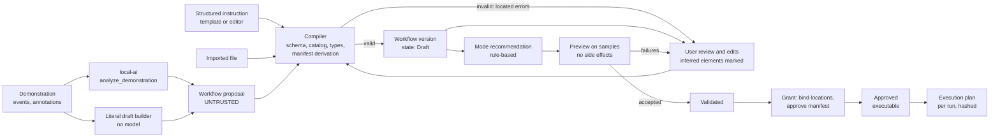

Three representations exist:

| Representation | Trust | Where it lives |
|---|---|---|
| Proposal | Untrusted | Memory only; logged for evidence |
| Workflow definition (version) | Trusted after compilation and user acceptance | Database; exportable JSON ([schema](../../schemas/workflow/0.1/workflow.schema.json)) |
| Execution plan | Derived; each operation still policy-checked at dispatch | Memory + journal; hash stored with the run |

The draft 0.1 schema and two examples are in [`schemas/`](../../schemas/workflow/0.1/workflow.schema.json) and [`examples/workflows/`](../../examples/workflows/README.md). The operation catalog is in [component-design.md §2](component-design.md#2-operation-catalog).

---

## 9. Runtime Scenarios

### 9.1 Workflow recording (MVP guided demonstration)

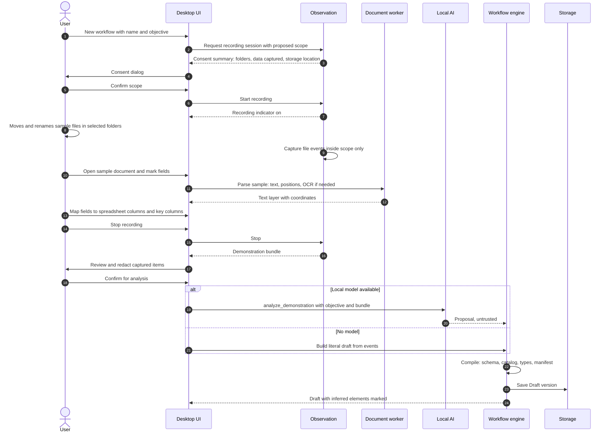

### 9.2 Exact Replay execution

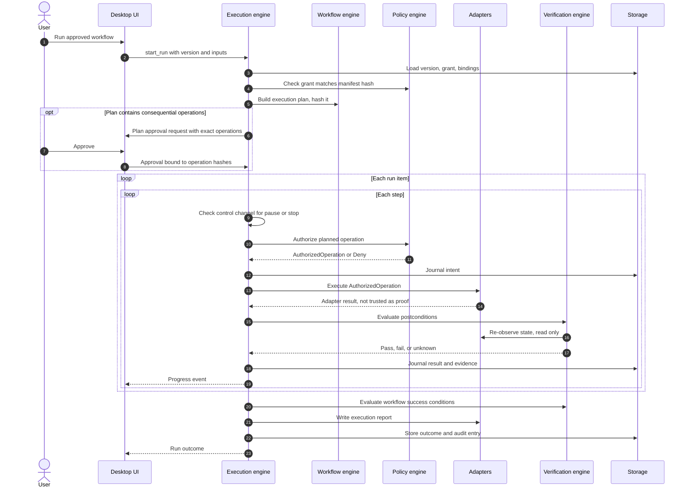

### 9.3 Adaptive Execution

**MVP: bounded decision point.**

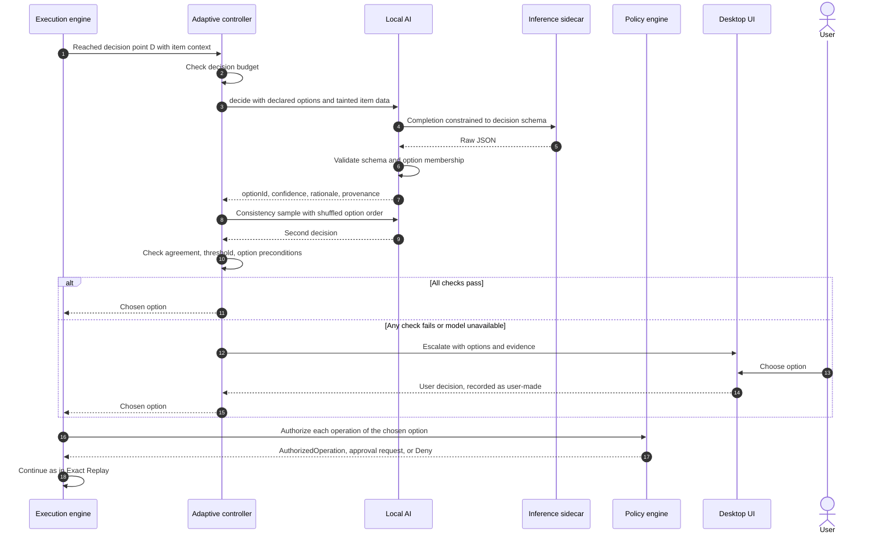

**Phase 2: adaptive browser loop (FR-052).**

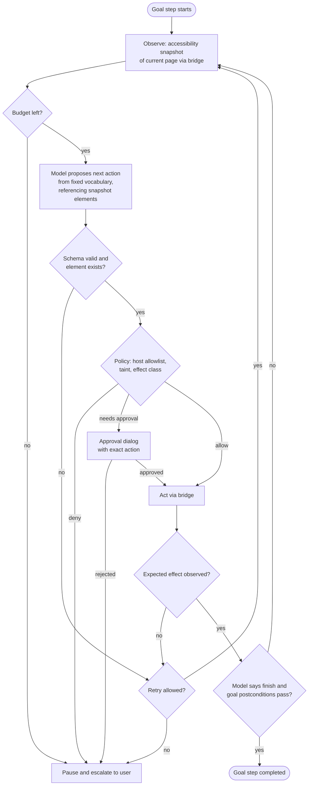

### 9.4 Local AI inference flow

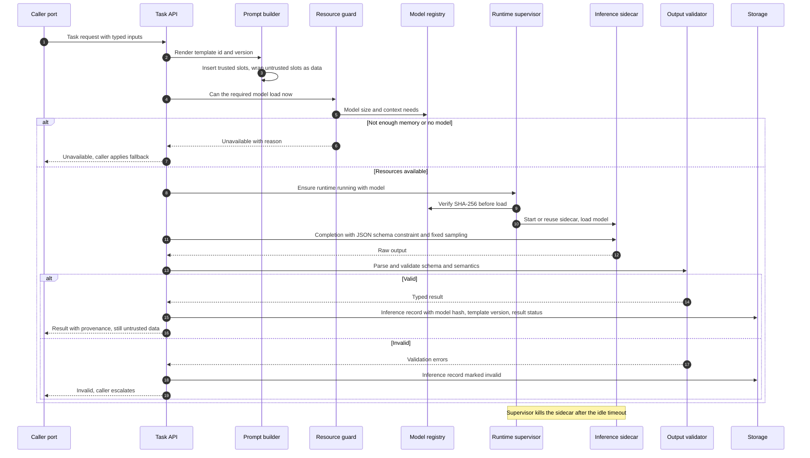

### 9.5 Failure and recovery flow

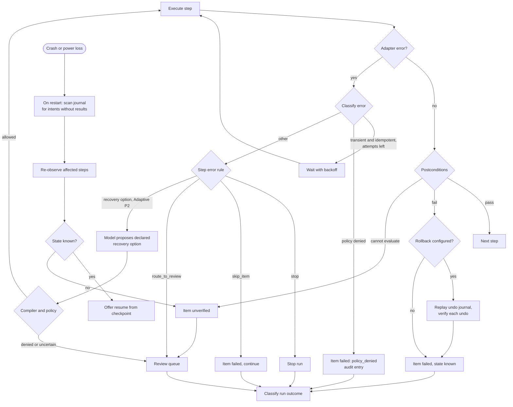

---

## 10. Data Architecture

### 10.1 Data flow (level 0)

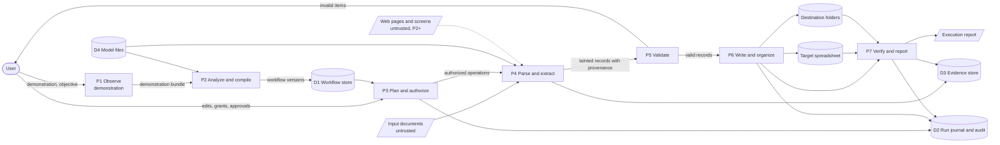

Detailed flows, data classification, taint propagation, and retention: [data-flow.md](data-flow.md).

### 10.2 Logical data model

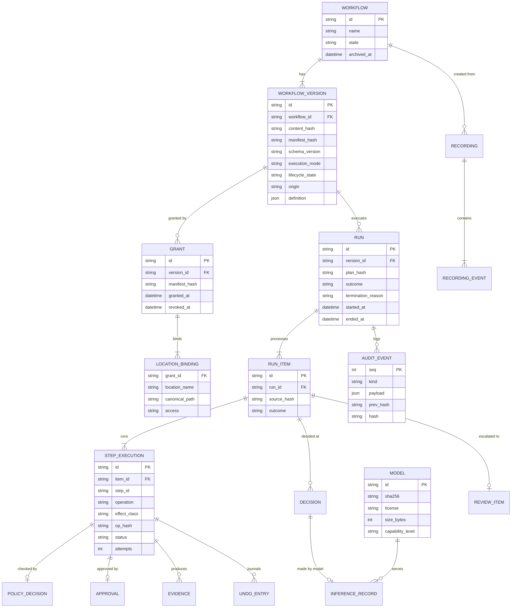

Column-level detail and indexes: [component-design.md §9](component-design.md#9-storage-design).

---

## 11. Security and Trust Boundaries

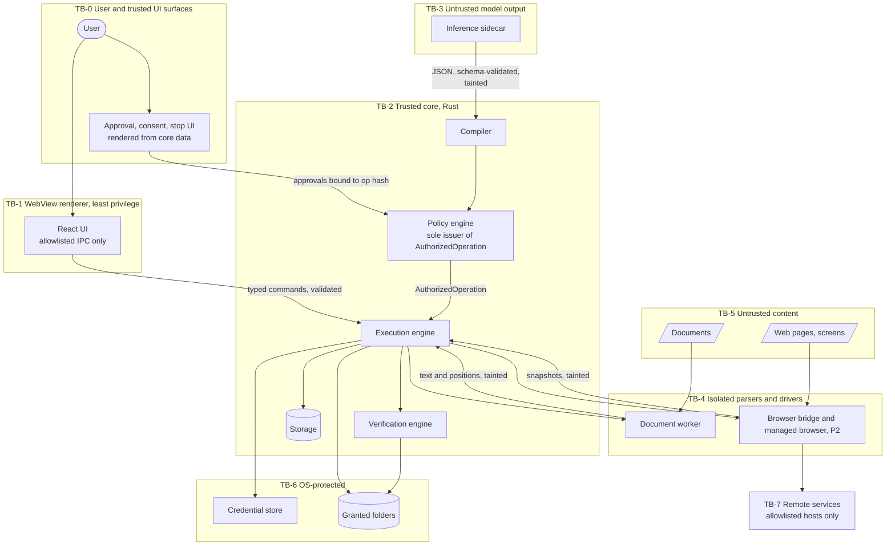

| Boundary | Main threat | Primary controls |
|---|---|---|
| TB-1 → TB-2 | Compromised or buggy UI issuing unintended commands | Allowlisted commands, typed validation, CSP, no remote content, approvals only via trusted UI path |
| TB-3 → TB-2 | Model misled by injected instructions or hallucinating | Schema validation, compiler, policy, option sets, budgets, escalation (FR-048 to FR-050) |
| TB-5 → TB-4 | Malicious files exploiting parsers | Separate worker process, no network use, minimal environment, crash containment |
| TB-4 → TB-2 | Tainted text steering execution | Taint tracking, sanitization, prompt data delimiting (FR-065, FR-106) |
| TB-2 → TB-6 | Writes outside scope, secret leakage | Canonicalization, handle re-check, secrets only in OS store (FR-105, NFR-016) |
| TB-4 → TB-7 | Exfiltration or unwanted submissions | Host allowlist, `external_send` approval (FR-074, FR-099) |

Full threat model (STRIDE per boundary), approval design, emergency stop design, and residual risks: [security-architecture.md](security-architecture.md).

---

## 12. Offline Deployment Architecture

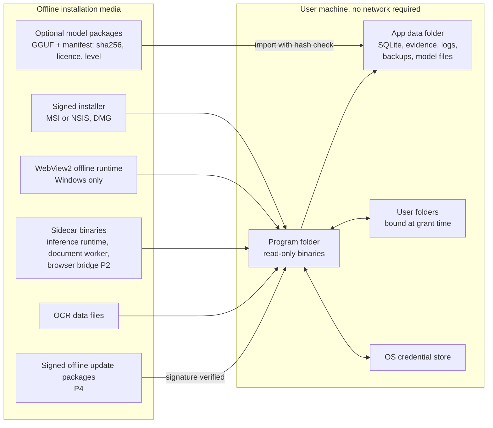

- Windows: the installer embeds the WebView2 offline installer (or uses a fixed-version runtime) so first launch works offline (FR-118). macOS uses the system WKWebView.
- Model packages are separate from the app installer so users choose a capability level that fits their hardware, and so the app can be distributed without bundling model licences it does not need.
- Paths: program files are read-only at runtime; all mutable state lives in the per-user app data folder resolved by the OS conventions (for example `%APPDATA%` on Windows, `~/Library/Application Support` on macOS).
- No update checks by default (FR-117). P4 adds signed offline update packages (NFR-019).

---

## 13. Platform-Specific Integration Boundaries

```mermaid
flowchart TB
    core["Shared core<br/>workflow, policy, execution,<br/>verification, storage, local-ai"]

    subgraph pal ["Platform abstraction traits"]
        t1["FileSystem and FileEvents"]
        t2["CredentialStore"]
        t3["AccessibilityTree, P3"]
        t4["InputInjector, P3"]
        t5["ScreenCapture, P2-P3"]
        t6["GlobalShortcut and Tray"]
        t7["ProcessSupervisor"]
    end

    subgraph win ["Windows implementations"]
        w1["Win32 file APIs, ReadDirectoryChangesW,<br/>GetFinalPathNameByHandle"]
        w2["Credential Manager / DPAPI"]
        w3["UI Automation COM"]
        w4["SendInput"]
        w5["Windows Graphics Capture"]
        w6["Tauri global shortcut, tray"]
        w7["Job objects for child processes"]
    end

    subgraph mac ["macOS implementations"]
        m1["POSIX + FSEvents, realpath, F_GETPATH"]
        m2["Keychain Services"]
        m3["AXUIElement, needs Accessibility permission"]
        m4["CGEvent, needs Accessibility permission"]
        m5["ScreenCaptureKit, needs Screen Recording permission"]
        m6["Tauri global shortcut, menu bar"]
        m7["Process groups"]
    end

    core --> pal
    t1 --> w1
    t1 --> m1
    t2 --> w2
    t2 --> m2
    t3 --> w3
    t3 --> m3
    t4 --> w4
    t4 --> m4
    t5 --> w5
    t5 --> m5
    t6 --> w6
    t6 --> m6
    t7 --> w7
    t7 --> m7
```

| Concern | Windows | macOS | Notes |
|---|---|---|---|
| Path canonicalization | Handle `\\?\`, UNC, junctions, 8.3 names, case-insensitivity | Symlinks, case-insensitive APFS by default, Unicode normalization | Shared tests with platform fixtures (FR-105) |
| Reserved names | `CON`, `PRN`, `AUX`, `NUL`, `COM1`… | `:` disallowed in Finder | Sanitizer covers both (FR-065) |
| File locks | Mandatory share locks (Excel holds them) | Advisory locks; detection is less reliable | EXC-08 behaviour differs; documented |
| OS permissions | UAC not required; no admin rights needed | TCC prompts for Accessibility, Screen Recording, Files and Folders | Request only when a feature needs it |
| Child process cleanup | Job object kills sidecars when LocalLoop exits | Process group + supervisor | Prevents orphaned model processes |
| Inference acceleration | CPU; GPU via Vulkan/CUDA builds where available | Metal | Per-platform runtime builds (EV-01) |

---

## 14. Technology Evaluation

| Technology | Role | Why it fits | Trade-offs | Alternatives considered | Status |
|---|---|---|---|---|---|
| **Tauri 2** | Desktop shell, IPC, packaging | Rust host fits the core; uses the system WebView, so binaries are much smaller than bundling Chromium; capability-based command permissions support NFR-014 | WebView behaviour differs between WebView2 and WKWebView; smaller ecosystem than Electron; Windows depends on WebView2 being present (bundle offline installer) | Electron (bundles Chromium + Node; larger, Node in the privileged process widens attack surface); Qt (C++, licensing considerations); Flutter desktop; native per-OS UIs (double effort) | Proposed (P§5) — Recommended |
| **React + TypeScript** | UI | Large ecosystem, typed UI code, familiar to contributors | Bundle size and complexity; must avoid rendering untrusted HTML | Svelte, Solid, Vue | Proposed (P§5) — Recommended |
| **Rust** | Core services, adapters, document worker | Memory safety for code that handles untrusted input; direct OS API access (`windows` crate, Objective-C bindings); good performance; single binary | Steeper learning curve; slower compile times; fewer high-level automation libraries (no official Playwright binding) | Python (rich AI/automation ecosystem, harder to package and secure as a desktop app); C#/.NET (strong on Windows, weaker macOS story for accessibility); Go | Proposed (P§5) — Recommended |
| **SQLite** | Local persistence | Embedded, transactional, WAL for crash safety, no server, widely tested | Single writer (fine for one active run); encryption needs SQLCipher or application-level encryption (D-07) | Embedded key-value stores (redb, sled); JSON files (no transactions); DuckDB (analytics-oriented) | Proposed (P§5) — Recommended |
| **Playwright** (via Node.js sidecar) | Browser automation (P2) | Auto-waiting, role/label locators that match FR-070, mature recorder concepts, CDP access when needed | No official Rust binding → separate Node process to package offline (EV-09); default browser downloads must be replaced by bundled or installed browsers | Direct CDP from Rust (for example `chromiumoxide`): fewer moving parts, Chromium-only, more code for waiting and locators; WebDriver BiDi (emerging standard); Selenium | Proposed (P§4.4) — Recommended behind a `BrowserAdapter` interface so the implementation can change |
| **Chrome DevTools Protocol** | Low-level browser control, snapshots | Direct access to accessibility tree and network events; used through Playwright | Chromium-specific; protocol changes across versions | WebDriver BiDi | Proposed (P§4.4) |
| **llama.cpp** (`llama-server` sidecar) | Local inference | GGUF quantized models for low memory; CPU, Metal, CUDA, and Vulkan backends; grammar/JSON-schema constrained sampling supports FR-110; process can be killed to free memory | Fast-moving project (pin versions); per-platform builds; output reproducibility not guaranteed across hardware | Ollama (convenient, but a separate service users install; listens on a network port by default); ONNX Runtime GenAI; MLC LLM; Rust-native engines (`candle`, `mistral.rs`) that embed in-process | Proposed (P§5 Layer 3) — Recommended, EV-01 |
| **Windows UI Automation** | Native app automation (P3) | Official accessibility API with element tree and control patterns | Coverage varies by app; custom-drawn and some Electron apps expose little; COM threading rules | App-specific APIs (COM automation for Office, not cross-platform), Win32 messages | Proposed (P§4.5) |
| **macOS Accessibility API** | Native app automation (P3) | Official, works across most Cocoa apps | Requires user-granted Accessibility permission; coverage varies | AppleScript / Apple Events (app-specific, permission prompts) | Proposed (P§4.5) |
| **OCR engine** | Text from scanned documents (MVP), screens (P3) | Required for P§12 | Accuracy, model size, language support, licence, and portability trade-off | Tesseract (Apache-2.0, mature, C++ dependency); PaddleOCR models via ONNX Runtime (higher accuracy on complex layouts, larger); `ocrs` (pure Rust, early-stage); OS-native (Windows.Media.Ocr, Apple Vision: no model shipping, but results differ by platform) | Pending EV-06 (D-04) |
| **PDF library** | Text extraction, page rendering | Needed for text-layer PDFs and OCR rendering | PDFium (via `pdfium-render`) is robust but needs a per-platform binary; pure-Rust parsers are weaker on complex PDFs; MuPDF is AGPL (licence implications) | PDFium, `lopdf`/`pdf-extract`, MuPDF | Recommended: PDFium in the document worker |
| **XLSX libraries** | Spreadsheet read/write | File-API approach per P§4.5 | Round-trip fidelity of formatting and advanced features is uncertain (A-05) | `calamine` (read), `rust_xlsxwriter` (write new files), `umya-spreadsheet` (read/write) | Pending EV-04 |
| **OS credential store** | Secrets | OS-level protection, no custom crypto (NFR-016) | API differences per OS (wrapped by `keyring`-style crate) | Encrypted file with user passphrase (more friction) | Recommended |

**Decision status summary:** all rows require confirmation in ADRs; see [ADR index](../adr/README.md). Version numbers are pinned at implementation time, not in this document.

---

## 15. Cross-Cutting Concerns

### 15.1 Process model and lifecycle

| Process | Started | Stopped | Privileges |
|---|---|---|---|
| Desktop app (UI + core) | User launch | User quit | User account; no admin |
| Document worker | First parse in a session | Idle timeout or app exit | Inherits only stdio; no network use by design |
| Inference sidecar | First AI task | Idle timeout (FR-112), app exit | Loopback only, session token |
| Browser bridge + browser (P2) | First browser step | Run end or app exit | Managed profile directory only |

All child processes are tied to the app's lifetime (job object / process group) so that a crash does not leave orphans consuming memory.

### 15.2 Error model

Errors are typed per module (`CompileError`, `PolicyDenial`, `AdapterError{transient|permanent|cancelled}`, `VerificationUnknown`, `ModelUnavailable`, …) and mapped to SRS exception IDs (EXC-nn) at the orchestrator, which decides the user-facing message (NFR-027).

### 15.3 Logging and diagnostics

Structured logs (JSON lines) with `run_id`, `item_id`, `step_id`, and `op_hash`; redaction at the logging boundary (FR-095); log rotation and retention settings (NFR-032). Diagnostics never leave the device unless the user exports them.

### 15.4 Configuration

User settings in the database; developer overrides via environment variables documented in `.env.example` (development builds only). No configuration is loaded from documents or websites.

### 15.5 Internationalization

English UI in the MVP (A-02), with strings externalized so translations can be added. Document processing must handle non-English text where the OCR engine supports it (EV-06 records language coverage).

### 15.6 Testing architecture

Ports-and-adapters design allows: pure unit tests for compiler, planner, policy, and verification; adapter integration tests against fixture folders and spreadsheets; end-to-end tests of the MVP scenario; fault injection through test adapters; and an offline test VM (NFR-006). See [tests/README.md](../../tests/README.md).

---

## 16. MVP Architecture

The MVP needs these components (detail and rationale in [MVP_SCOPE.md](../development/MVP_SCOPE.md)):

| Needed for MVP | Deferred |
|---|---|
| Desktop UI (subset of screens), shell services, stop | Browser recorder (P2), desktop recorder (P3) |
| Observation: guided demonstration + file events | Browser adapter and bridge (P2; MVP only if D-02) |
| workflow-engine: model, compiler, planner, recommender | Desktop adapter, UIA/AX (P3) |
| policy-engine: manifest, grants, canonicalization, taint, approvals | VLM, screen capture (P3) |
| execution-engine: orchestrator, journal, control, approvals, decision points | Adaptive browser loop, recovery proposals (P2) |
| verification-engine: MVP postconditions, outcomes, rollback | Signed offline updates (P4) |
| adapters: files, documents (+ worker), spreadsheet | |
| local-ai: registry, guard, supervisor, extract/decide/analyze/explain | |
| storage: DB, journal, evidence, audit chain, backup | |

Everything in the left column except `local-ai` is needed for the model-free path. The model-free path is the first end-to-end milestone (Roadmap M1.3), and AI features are layered on afterwards. As a result, the MVP never depends on a model to be useful.

---

## 17. Architecture Risks and Open Questions

| ID | Risk / question | Impact | Mitigation / next step |
|---|---|---|---|
| AR-01 | Small local models may be unreliable at analysis and decisions | AI features under-deliver | Constrained outputs, option sets, escalation; EV-02/EV-03 decide scope; model-free path first |
| AR-02 | XLSX round-trip may damage user formatting | Data integrity concerns | EV-04; backups; reject unsupported workbooks; option to write a separate output sheet/file |
| AR-03 | Packaging Node + Playwright + browser offline is heavy | Installer size, complexity | EV-09; consider direct CDP from Rust; keep browser optional |
| AR-04 | WebView differences across OSes | UI bugs | Cross-platform UI tests; avoid bleeding-edge web APIs |
| AR-05 | Process isolation of the document worker is not a full sandbox | Parser exploits could still act as the user | P4: OS sandboxing (AppContainer / restricted token on Windows, App Sandbox entitlements on macOS) evaluated |
| AR-06 | Global stop shortcut conflicts or is blocked during input injection (P3) | Stop less reachable | Tray/menu-bar stop as well; screen-corner failsafe evaluated for P3 |
| AR-07 | Local audit chain can be rewritten by a fully privileged local attacker | Limited tamper evidence | State the limitation; P4 checkpoint export |
| AR-08 | Prompt-injection techniques evolve | Model misled more often | Policy is the primary control and does not depend on the model; corpus updated each phase |

---

## 18. Architecture Decision Records

| ADR | Title | Status |
|---|---|---|
| [ADR-0001](../adr/0001-initial-architecture.md) | Initial architecture: layered core, AI outside the trusted path | Proposed |
| [ADR-0002](../adr/0002-closed-operation-catalog.md) | Closed operation catalog; no arbitrary command execution | Proposed |
| [ADR-0003](../adr/0003-local-inference-sidecar.md) | Local inference via an on-demand llama.cpp sidecar | Proposed |
| [ADR-0004](../adr/0004-browser-automation-bridge.md) | Browser automation through a Playwright bridge process | Proposed |
| [ADR-0005](../adr/0005-workflow-definition-format.md) | JSON workflow definition with JSON Schema and symbolic locations | Proposed |
