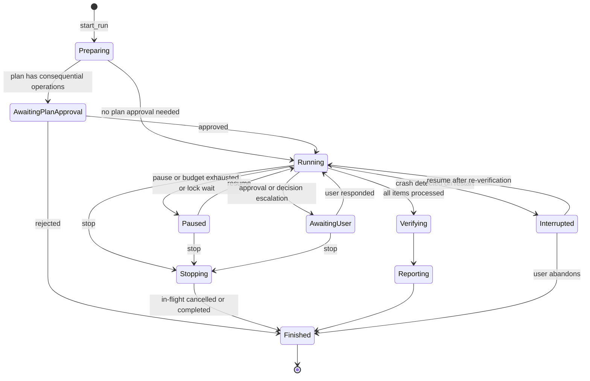
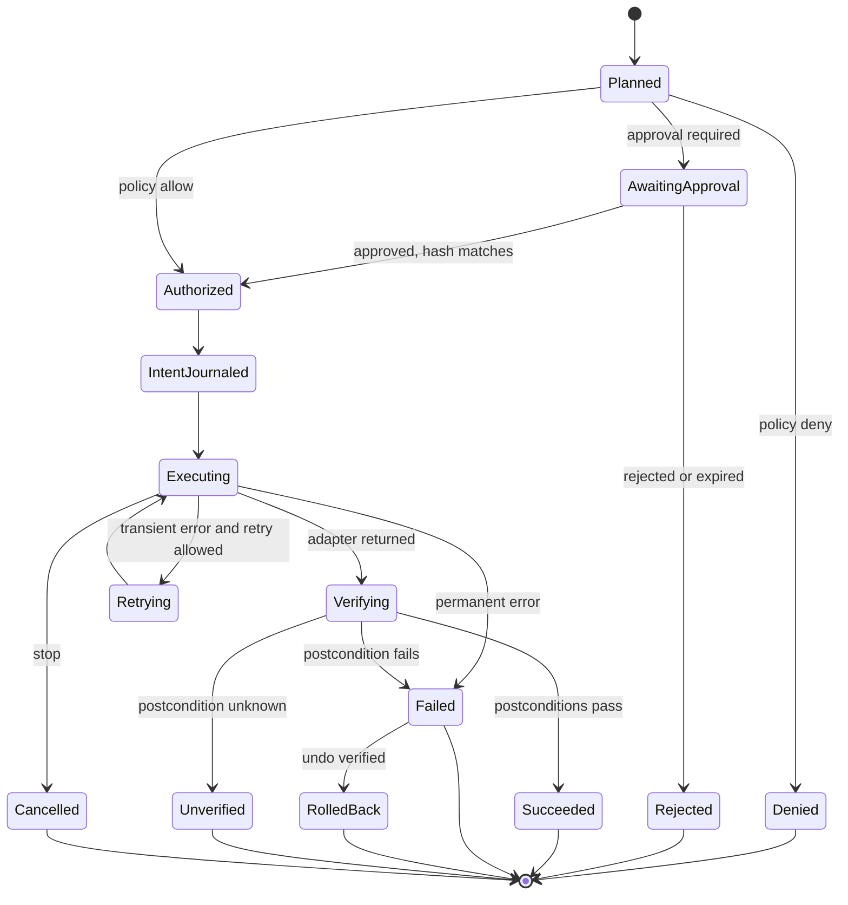

# LocalLoop — Component Design

| Field | Value |
|---|---|
| Version | 0.1 (draft) |
| Date | 2026-10-09 |
| Parent | [SYSTEM_ARCHITECTURE.md](SYSTEM_ARCHITECTURE.md) |

> **Status:** Design only. Code blocks are **design sketches** that show intended responsibilities and type boundaries. They are not compiled, and names may change during implementation. No module described here exists yet.

---

## 1. Purpose and Conventions

This document details each module's responsibilities, public interfaces, internal state, and protocols. Requirement IDs refer to the [SRS](../requirements/SRS.md).

Conventions: Rust sketches use `async_trait`-style async traits and `Result<T, E>` with typed errors; JSON examples are abbreviated.

---

## 2. Operation Catalog

The catalog is the complete list of operations LocalLoop can execute (FR-104, ADR-0002). An operation not listed here does not exist. Adding one requires an ADR describing its effect class, scope rules, postconditions, and undo behaviour.

### 2.1 Effect classes

| Effect class | Meaning | Approval by default |
|---|---|---|
| `read` | Reads within granted scope | No |
| `compute` | Pure transformation of data already read | No |
| `inference` | Local model call producing data only | No (output checked) |
| `interact` | Changes UI state in a page or app without committing data (P2+) | No |
| `write_reversible` | Changes local state with a journaled, verifiable undo | No |
| `write_irreversible` | Changes local state without undo | **Yes** |
| `external_read` | Reads from an allowlisted remote host | No |
| `external_send` | Sends data to, or commits an action on, a remote host | **Yes** |

Any step can additionally be marked `approval: "required"` by the author; the analyzer proposes this marking for controls whose accessible name suggests committing (for example *Submit*, *Send*, *Pay*, *Delete*, *Confirm*, *Post*, *Transfer*).

### 2.2 MVP operations (schema 0.1)

| Operation | Effect | Idempotent | Undo | Default postconditions | Adapter |
|---|---|---|---|---|---|
| `files.list` | read | Yes | — | — | files |
| `files.copy` | write_reversible | Yes (same destination and hash) | Remove the copy, only if its hash still matches what LocalLoop wrote | `file.exists` (destination), `file.hash_equals` | files |
| `files.move` | write_reversible | Detectable (destination has source hash and source is gone) | Move back | `file.exists` (destination), `file.absent` (source), `file.hash_equals` | files |
| `files.rename` | write_reversible | Detectable | Rename back | Same as `files.move` | files |
| `docs.read_text` | read | Yes | — | — | documents (via document worker) |
| `extract.fields` (`rules`) | compute | Yes | — | Output conforms to record schema | workflow-engine |
| `extract.fields` (`local_model`) | inference | No (model output may vary) | — | Output conforms to record schema | local-ai |
| `validate.record` | compute | Yes | — | — | workflow-engine |
| `sheet.upsert_rows` | write_reversible | Yes (by key columns) | Restore backup, only if the file still has the post-write hash; otherwise report a conflict | `sheet.row_present`, `sheet.row_count_delta` | spreadsheet |
| `report.write` | write_reversible | Yes | Remove written report files | `report.written` | files |
| `review.enqueue` | write_reversible | Yes | Dequeue | Review item exists | execution-engine |

### 2.3 Control constructs (not operations)

| Construct | Purpose |
|---|---|
| `control.for_each` | Iterate over a list (for example the documents from `files.list`); each element becomes a run item |
| `control.if` | Branch on a declarative condition (§8) |
| `control.decide` | Decision point: choose one declared option (model in Adaptive Execution, user fallback) |
| `control.stop_item` | End the current item with a declared outcome and reason |
| `human.approve` | Pause for explicit approval with a message |

### 2.4 Planned operations (later phases)

| Operation | Effect | Phase |
|---|---|---|
| `browser.open`, `browser.navigate` | external_read | MVP if D-02, else P2 |
| `browser.download` | external_read (file lands in LocalLoop staging; moved by `files.move`) | MVP if D-02, else P2 |
| `browser.click`, `browser.fill`, `browser.select` | interact (consequential if marked) | P2 |
| `browser.upload`, `browser.submit` | external_send | P2 |
| `browser.extract` | read | P2 |
| `browser.goal` (adaptive loop, FR-052) | composite; each inner action classified individually | P2 |
| `desktop.focus_window`, `desktop.invoke`, `desktop.set_value` | interact (consequential if marked) | P3 |
| `desktop.read` | read | P3 |
| `input.click_at`, `input.type_text` (visual fallback) | interact; requires an expected-effect postcondition | P3 |
| `screen.capture_window` | read | P2–P3 |

### 2.5 Operations that will not be added

`shell.exec`, `script.run`, `code.eval`, generic `http.request`, permanent `files.delete`, reading raw credential values into variables, and modifying OS settings. These are excluded by C-02 and ADR-0002; any proposal to add one needs a new ADR and a security review.

---

## 3. Module Designs

### 3.1 `workflow-engine` — domain model, compiler, planner, recommender

**Responsibilities.** Owns the workflow domain types and the *ports* (traits) other modules implement; compiles proposals and edits into definitions (FR-031); validates definitions against the JSON Schema; resolves templates and conditions; builds execution plans and previews (FR-034); computes mode recommendations (FR-035 to FR-039). It has no I/O and depends on no internal module.

```rust
// Design sketch — not compiled.
pub struct WorkflowDefinition {
    pub schema_version: SchemaVersion,
    pub id: WorkflowId,
    pub name: String,
    pub objective: String,
    pub execution_mode: ExecutionMode,          // ExactReplay | Adaptive
    pub locations: BTreeMap<LocationName, LocationSpec>,
    pub permissions: PermissionManifest,
    pub record_schema: Option<RecordSchema>,
    pub steps: Vec<Step>,
    pub success_conditions: Vec<Postcondition>,
    pub known_limitations: Vec<String>,
}

pub enum Step {
    Operation(OperationStep),   // one catalog operation
    ForEach(ForEachStep),
    If(IfStep),
    Decide(DecisionStep),
    StopItem(StopItemStep),
    Approve(ApproveStep),
}

pub fn compile(input: CompileInput, catalog: &Catalog) -> Result<CompiledWorkflow, Vec<CompileError>>;
pub fn plan_item(wf: &CompiledWorkflow, item: &ItemContext) -> Result<ItemPlan, PlanError>;
pub fn recommend_mode(signals: &ModeSignals) -> ModeRecommendation;

pub mod ports {
    // Implemented by local-ai. Results are untrusted data.
    #[async_trait] pub trait WorkflowAnalyzer { async fn analyze(&self, d: &Demonstration) -> Result<WorkflowProposal, AiError>; }
    #[async_trait] pub trait FieldExtractor  { async fn extract(&self, doc: &DocumentText, schema: &RecordSchema) -> Result<Tainted<Record>, AiError>; }
    #[async_trait] pub trait DecisionProvider { async fn decide(&self, req: &DecisionRequest) -> Result<ModelDecision, AiError>; }
}
```

**Key rules.**
- `Tainted<T>` wraps any value from documents, pages, screens, or models. Only explicit sanitizers (`sanitize_path_segment`, `parse_decimal`, …) produce untainted derivatives, and only for permitted parameter positions (FR-106).
- Compilation errors carry a JSON Pointer to the offending field so the editor can highlight it (FR-012).
- The compiler derives the minimum permission manifest from steps and rejects undeclared access (FR-102).

### 3.2 `policy-engine` — permissions, scopes, taint, approvals

**Responsibilities.** Evaluates every resolved operation (§5); canonicalizes paths (FR-105); enforces host allowlists (FR-074) and taint rules (FR-106); determines approval requirements (FR-099); issues `AuthorizedOperation`, the only type adapters accept.

```rust
// Design sketch — not compiled.
pub enum PolicyDecision {
    Allow(AuthorizedOperation),
    RequireApproval(ApprovalRequest),   // carries op_hash and human-readable summary
    Deny(Denial),                       // reason code + message; audit-logged
}

pub fn evaluate(op: &ResolvedOperation, ctx: &PolicyContext<'_>) -> PolicyDecision;

/// Constructible only inside policy-engine (private field). Adapters accept nothing else.
pub struct AuthorizedOperation {
    op: ResolvedOperation,
    op_hash: OpHash,
    paths: Vec<AuthorizedPath>,
    _seal: private::Seal,
}

impl AuthorizedOperation {
    /// Exchange an approval token for an authorization; fails if the hash differs or the token was used.
    pub fn redeem(req: ApprovalRequest, token: ApprovalToken, ledger: &mut ApprovalLedger) -> Result<Self, RedeemError>;
}

pub struct AuthorizedPath { canonical: PathBuf, location: LocationName, access: Access }
impl AuthorizedPath {
    /// Re-check after opening: the handle's final path must still be inside the location (TOCTOU defence).
    pub fn verify_handle(&self, file: &std::fs::File) -> Result<(), ScopeViolation>;
}
```

### 3.3 `execution-engine` — orchestration, journal, control, decisions

**Responsibilities.** Runs the state machines in §4; consults the policy engine before every dispatch; writes the journal; manages approvals (§6) and decision points (§7); enforces budgets (FR-050); exposes pause, resume, and stop (FR-097, FR-098); enforces a single active run (FR-101).

```rust
// Design sketch — not compiled.
#[async_trait]
pub trait OperationAdapter: Send + Sync {
    fn kinds(&self) -> &'static [OperationKind];
    async fn execute(&self, op: AuthorizedOperation, cancel: CancellationToken) -> Result<AdapterOutcome, AdapterError>;
    async fn undo(&self, entry: &UndoEntry, cancel: CancellationToken) -> Result<(), AdapterError>;
}

pub enum AdapterError { Transient(String), Permanent(String), Cancelled, ScopeViolation(String) }

pub struct RunHandle { /* channel to the orchestrator task */ }
impl RunHandle {
    pub fn pause(&self); pub fn resume(&self); pub fn stop(&self);   // stop is idempotent
    pub fn approve(&self, id: ApprovalId, decision: ApprovalDecision);
    pub fn resolve_decision(&self, id: DecisionId, option: OptionId);
}

pub async fn start_run(req: StartRun, deps: &EngineDeps) -> Result<RunHandle, StartError>;
pub async fn recover_interrupted(deps: &EngineDeps) -> Vec<InterruptedRun>;   // FR-091
```

### 3.4 `verification-engine` — postconditions, outcomes, recovery

**Responsibilities.** Evaluates postconditions through read-only observation (FR-085); classifies outcomes (FR-086, FR-087); chooses recovery actions from the step's rules (FR-089); produces rollback plans from the undo journal (FR-090).

```rust
// Design sketch — not compiled.
#[async_trait]
pub trait StateObserver: Send + Sync {
    async fn observe(&self, q: &ObservationQuery) -> Result<Observation, ObserveError>;  // read-only
}

pub enum PostconditionResult { Pass, Fail { detail: String }, Unknown { reason: String } }

pub fn evaluate(p: &Postcondition, obs: &Observation) -> PostconditionResult;
pub fn classify_item(steps: &[StepRecord]) -> Outcome;
pub fn classify_run(items: &[ItemRecord], success: &[PostconditionResult]) -> (Outcome, TerminationReason);
pub fn next_action(failure: &StepFailure, rules: &ErrorRule, attempts: u32) -> RecoveryAction;
```

### 3.5 `local-ai` — model registry, runtime, prompts, structured outputs

**Responsibilities.** Implements the AI ports; manages models (FR-108), capability levels (FR-109), resource checks (FR-113), the inference sidecar lifecycle (FR-112), versioned prompt templates, and output validation (FR-110). Cannot depend on policy, execution, adapters, or storage (NFR-030); persistence of inference records goes through a port implemented by `storage`.

| Task | Port | Template output schema |
|---|---|---|
| Demonstration analysis | `WorkflowAnalyzer` | Workflow proposal (catalog operations only) |
| Field extraction | `FieldExtractor` | The workflow's record schema |
| Decision | `DecisionProvider` | `{ "optionId": enum[declared], "confidence": 0..1, "rationale": string<=280 }` |
| Mode signals | `ModeSignalDeriver` | Factor labels |
| Explanation | `Explainer` | `{ "text": string<=600 }` |

Prompt template file layout (planned): `crates/local-ai/templates/<task>/<version>.toml` with `id`, `version`, `system`, `slots` (each marked `trusted` or `untrusted`), and `output_schema`.

### 3.6 `observation` — recording sessions

**Responsibilities.** Consent and scope (FR-015), indicator state (FR-016), scope filtering (FR-017), protected-input exclusion (FR-018), redaction (FR-019), file event capture (FR-020), annotation and mapping capture (FR-021, FR-022), retention (FR-027).

```rust
// Design sketch — not compiled.
pub struct RecordingScope { folders: Vec<CanonicalPath>, apps: Vec<AppId> /* P3 */, browser: bool /* P2 */ }
pub struct RecorderSession { /* state machine: Created -> Consented -> Recording <-> Paused -> Stopped -> Reviewed */ }
impl RecorderSession {
    pub fn consent(&mut self, summary_hash: Hash) -> Result<(), RecorderError>;   // must match the shown summary
    pub fn start(&mut self) -> Result<(), RecorderError>;
    pub fn redact(&mut self, ids: &[EventId]) -> Result<(), RecorderError>;
    pub fn finish(self) -> Result<Demonstration, RecorderError>;
}
```

### 3.7 `storage` — persistence, journal, audit chain, evidence, backup

**Responsibilities.** Database access, migrations, repositories, append-only journal and audit chain (FR-094), evidence files with encryption for sensitive data (NFR-017), backups (FR-119), retention cleanup (FR-120). Details in §9.

### 3.8 Adapters

| Adapter | Implements | Notes |
|---|---|---|
| `adapters/files` | `OperationAdapter`, `StateObserver` | Uses `AuthorizedPath::verify_handle`; atomic rename where same-volume; copy + hash verify + source removal for cross-volume moves; never overwrites (collision policy) |
| `adapters/documents` | `OperationAdapter`, `StateObserver` | Client of the document worker (§10.1); reads file bytes itself (inside policy) and sends bytes, so the worker needs no file access |
| `adapters/spreadsheet` | `OperationAdapter`, `StateObserver` | Lock detection, structure check, backup, temp-write + atomic replace, re-read verification, formula neutralization (FR-063) |
| `adapters/browser` (P2) | `OperationAdapter`, `StateObserver` | Client of the browser bridge (§10.3); downloads land in LocalLoop staging only |
| `adapters/desktop` (P3) | `OperationAdapter`, `StateObserver` | UIA / AX via platform layer; input injection limited to granted app windows |

### 3.9 Document worker (binary in `crates/adapters/documents`)

A separate process that parses untrusted files: PDF text extraction, page rendering, image decoding, OCR. It receives bytes over stdin and returns structured text. Limits: maximum input size, page count, and per-request time; the core kills and restarts the worker on timeout or crash (EXC-23). It does not open files or network connections by design; OS-level sandboxing is a Phase 4 hardening item (AR-05).

### 3.10 `apps/desktop` — composition root and IPC

Wires implementations to ports, registers Tauri commands (§11), owns shell services (tray, global shortcut, indicators), and contains the React UI under `apps/desktop/src` (planned). Command handlers are thin: validate DTO → call a core service → map errors to user-facing messages.

---

## 4. State Machines

### 4.1 Run



On `Finished`, the verification engine assigns the outcome and termination reason ([SRS §16.1](../requirements/SRS.md#161-outcome-definitions)).

### 4.2 Step execution



---

## 5. Policy Evaluation

```text
evaluate(op, ctx):
  1  if op.kind not in catalog(release)            -> Deny(UNKNOWN_OPERATION)
  2  if op.kind not in ctx.grant.manifest.operations -> Deny(NOT_IN_MANIFEST)
  3  validate op.params against the operation's parameter schema
                                                    -> Deny(INVALID_PARAMS) on failure
  4  for each path parameter p:
       c = canonicalize(p)   # resolve .., links, junctions, platform prefixes
       loc = binding containing c with required access
       if none                                      -> Deny(OUT_OF_SCOPE)      (EXC-11)
  5  for each host parameter h:
       if h not in ctx.grant.manifest.hosts         -> Deny(HOST_NOT_ALLOWED)
  6  for each tainted value v in op.params:
       if position(v) not in permitted_positions(op.kind)
                                                    -> Deny(TAINTED_POSITION)
       if position(v) requires sanitizer and v not sanitized
                                                    -> Deny(UNSANITIZED)
  7  if ctx.mode == Adaptive and op came from a decision:
       if op not reachable from chosen declared option -> Deny(OUTSIDE_OPTION)
  8  if effect_class(op) in {write_irreversible, external_send} or op.marked_consequential:
       if ctx.approvals has unused token for hash(op) -> Allow(redeem)
       else                                         -> RequireApproval(hash(op))
  9  -> Allow(AuthorizedOperation)
```

Every `Deny` and every approval request is written to the audit chain with the reason code (FR-094). The policy engine never consults the model.

---

## 6. Approval Design

- **What is approved:** an *operation hash* = SHA-256 over the canonical JSON of the operation kind and fully resolved parameters (paths canonicalized, templates expanded).
- **Plan approval:** before a run starts, all consequential operations that are known from the plan are presented together; the user can approve all, approve a subset (the rest are skipped with `approval_rejected`), or cancel (FR-099).
- **Individual approval:** consequential operations that arise during the run (for example from a decision) are approved one at a time.
- **Token properties:** single-use, bound to `run_id` and `op_hash`, expire when the run ends, stored in the approval ledger, recorded in the audit chain.
- **Trusted rendering:** the approval dialog shows data generated by the core from the resolved operation, with untrusted values visibly marked as coming from a document or page. It never renders HTML from untrusted sources.
- **No approval by default** in model-chosen paths: a model cannot "pre-approve" anything; only the UI path issues tokens.

---

## 7. Decision Point Design

A `control.decide` step declares: `question`, `options[]` (each with `id`, `description`, optional `requires` condition, and nested `steps`), `minConfidence`, and `fallback` (`ask_user` or a default option ID).

Checks before accepting a model decision (FR-049):

1. Output is valid against the decision schema and `optionId` is a declared option.
2. The option's `requires` condition is true for the item's validated data.
3. **Consistency check:** a second call with the options in a different order returns the same option. Disagreement → escalate. (Self-reported confidence from small models is poorly calibrated, so it is one signal among several, not the gate on its own. Calibration is measured in EV-03.)
4. `confidence ≥ minConfidence`.
5. Budget not exhausted (FR-050).

If any check fails or the model is unavailable → `fallback`. With `ask_user`, the item waits in the run monitor; other items may continue if the workflow allows it.

---

## 8. Expressions and Templates

Conditions and templates are **data**, not code. No general-purpose expression language is embedded (no JavaScript, Lua, or `eval`).

**Conditions** (JSON):

```json
{ "all": [
    { "field": "record.currency", "op": "equals", "value": "PHP" },
    { "field": "record.total", "op": "greaterThan", "value": 0 }
] }
```

Operators: `equals`, `notEquals`, `greaterThan`, `greaterOrEqual`, `lessThan`, `lessOrEqual`, `contains`, `matches` (regular expression with a length and complexity limit to avoid catastrophic backtracking), `isEmpty`, `isNotEmpty`, `in`; combinators `all`, `any`, `not`.

**Templates** for file names and report fields: `{{record.vendor_name | slug}}_{{record.invoice_date | date:"%Y-%m-%d"}}.pdf`. Filters are a fixed list: `slug`, `upper`, `lower`, `date`, `number`, `truncate`, `default`. When a template produces a path segment, the result passes `sanitize_path_segment` (FR-065).

---

## 9. Storage Design

SQLite, WAL mode, foreign keys on. All timestamps UTC ISO 8601. IDs are UUIDv7 (time-ordered) unless noted.

| Table | Key columns | Purpose | Requirements |
|---|---|---|---|
| `workflows` | `id`, `name`, `description`, `created_at`, `archived_at` | Workflow identity | FR-001, FR-006 |
| `workflow_versions` | `id`, `workflow_id`, `seq`, `content_hash` (unique), `manifest_hash`, `schema_version`, `execution_mode`, `lifecycle_state`, `origin`, `parent_version_id`, `definition_json`, `change_summary`, `created_at` | Immutable versions | FR-003, FR-009, FR-011 |
| `mode_recommendations` | `version_id`, `recommended_mode`, `selected_mode`, `factors_json`, `explanation`, `created_at` | Recommendation record | FR-035, FR-041 |
| `grants` | `id`, `version_id`, `manifest_hash`, `granted_at`, `revoked_at`, `revoke_reason` | Permission grants | FR-103, FR-107 |
| `location_bindings` | `grant_id`, `location_name`, `canonical_path`, `access`, `recursive` | Location → folder | FR-103 |
| `recordings` | `id`, `workflow_id`, `objective`, `scope_json`, `consent_summary_hash`, `consented_at`, `started_at`, `ended_at`, `status`, `retain_until` | Recording sessions | FR-015, FR-027 |
| `recording_events` | `id`, `recording_id`, `seq`, `kind`, `payload_json` (redacted), `artifact_ref`, `deleted_at` | Captured events | FR-017 to FR-020 |
| `runs` | `id`, `version_id`, `mode`, `plan_hash`, `status`, `outcome`, `termination_reason`, `inputs_json`, `report_path`, `started_at`, `ended_at` | Runs | FR-086, FR-093 |
| `run_items` | `id`, `run_id`, `seq`, `source_ref`, `source_hash`, `status`, `outcome` | Items | FR-086, FR-091 |
| `step_executions` | `id`, `item_id`, `step_id`, `operation`, `effect_class`, `op_hash`, `params_masked_json`, `policy_decision`, `approval_id`, `status`, `attempts`, `error_category`, `error_message`, `started_at`, `ended_at` | Step records | FR-088, FR-093 |
| `journal` | `seq` (autoincrement), `step_execution_id`, `phase` (`intent`/`result`), `payload_json`, `created_at` | Crash-safe intent/result log | FR-091, NFR-004 |
| `undo_entries` | `id`, `step_execution_id`, `kind`, `payload_json`, `undone_at` | Rollback data | FR-090 |
| `postcondition_results` | `step_execution_id`, `kind`, `result`, `detail_json` | Verification results | FR-085 |
| `decisions` | `id`, `item_id`, `decision_point_id`, `option_id`, `made_by` (`model`/`user`), `confidence`, `rationale`, `inference_id`, `created_at` | Decision record | FR-047, FR-051 |
| `inference_records` | `id`, `model_id`, `model_sha256`, `task`, `template_id`, `template_version`, `params_json`, `status`, `latency_ms`, `output_json` (if retention allows), `created_at` | AI provenance | AIC-07 |
| `approvals` | `id`, `run_id`, `op_hash`, `scope` (`plan`/`single`), `status`, `requested_at`, `decided_at`, `expires_at`, `used_at` | Approval ledger | FR-099 |
| `review_items` | `id`, `item_id`, `reason`, `state`, `resolution`, `created_at`, `resolved_at` | Review queue | FR-061 |
| `evidence` | `id`, `run_id`, `item_id`, `step_execution_id`, `kind`, `path`, `sha256`, `sensitivity`, `encrypted`, `created_at` | Evidence index | FR-059, FR-120 |
| `processed_documents` | `workflow_id`, `source_hash` (unique together), `version_id`, `run_id`, `item_id`, `processed_at` | Duplicate protection | FR-067 |
| `audit_events` | `seq` (autoincrement), `at`, `kind`, `actor`, `subject_ref`, `payload_json`, `prev_hash`, `hash` | Tamper-evident audit chain | FR-094 |
| `models` | `id`, `display_name`, `path`, `sha256`, `size_bytes`, `license`, `capability_level`, `context_length`, `added_at` | Model registry | FR-108 |
| `settings` | `key`, `value_json` | Settings | — |

Indexes: `workflow_versions(workflow_id, seq)`, `runs(version_id, started_at)`, `run_items(run_id, seq)`, `step_executions(item_id)`, `journal(step_execution_id)`, `audit_events(kind, at)`.

Rules: `workflow_versions.definition_json` and `audit_events` rows are never updated (enforced by triggers that raise on `UPDATE`); `journal` is append-only; migrations run in a transaction after an automatic backup.

---

## 10. Inter-Process Protocols

### 10.1 Core ↔ document worker

Length-prefixed frames on stdio (4-byte big-endian length, then UTF-8 JSON; binary payloads base64-encoded or sent as a following raw frame with declared length).

```jsonc
// request
{ "id": "7f1c…", "method": "parse", "params": { "mediaType": "application/pdf", "ocr": { "mode": "auto", "languages": ["eng"] }, "limits": { "maxPages": 50 } } }
// response
{ "id": "7f1c…", "result": { "pages": [ { "number": 1, "width": 612, "height": 792, "source": "text_layer",
  "words": [ { "text": "Invoice", "bbox": [72, 90, 130, 104] } ] } ], "warnings": [] } }
```

Methods: `parse`, `render_page` (PNG for the annotation UI), `health`. The worker refuses requests over the limits and returns typed errors (`encrypted_document`, `unsupported_format`, `limit_exceeded`, `ocr_unavailable`).

### 10.2 Core ↔ inference sidecar

The supervisor starts the runtime's HTTP server bound to `127.0.0.1` on a random free port with a generated API key, and sends completion requests carrying a JSON schema so the runtime constrains generation to valid JSON (exact endpoint and parameter names pinned to the runtime version chosen in EV-01). Sampling: temperature 0 or fixed seed (AIC-06). Timeouts per task; one retry for invalid output where configured (EXC-17).

### 10.3 Core ↔ browser bridge (P2; MVP if D-02)

JSON-RPC 2.0 over stdio.

| Method | Purpose |
|---|---|
| `session.open { profileDir, channel, allowlist }` | Launch managed browser with LocalLoop profile; bridge also enforces the allowlist with request interception |
| `page.navigate { url }` | Navigate (host must be allowlisted) |
| `page.snapshot {}` | Accessibility snapshot with element references for targeting and adaptive proposals |
| `element.click { target }`, `element.fill { target, value \| secretRef }`, `element.select { target, option }` | Interactions; `secretRef` values are resolved by the core from the OS store and passed in memory only |
| `download.await { timeoutMs }` | Wait for a download into the bridge's staging folder; the core then moves it under policy |
| `session.close {}` | Close browser and bridge session |

Events: `page.navigated`, `request.blocked` (non-allowlisted host), `dialog.opened`, `challenge.detected` (EXC-26).

*Option under evaluation (EV-09):* in Adaptive Execution, hold any non-GET request triggered by a model-chosen action until the step is approved as `external_send`, to catch committing actions that are not labelled as such.

---

## 11. Desktop IPC Command Surface

Commands the UI may call (allowlist; everything else is refused, NFR-014). Payloads are typed DTOs generated into `packages/shared`.

| Area | Commands |
|---|---|
| Library | `workflow.list`, `workflow.get`, `workflow.create`, `workflow.duplicate`, `workflow.archive`, `workflow.restore`, `workflow.export`, `workflow.import` |
| Editing | `workflow.save_draft`, `workflow.compile`, `workflow.history`, `workflow.revert` |
| Recording | `recording.prepare`, `recording.consent`, `recording.start`, `recording.pause`, `recording.resume`, `recording.stop`, `recording.redact`, `recording.analyze`, `recording.delete` |
| Mode and validation | `mode.recommend`, `mode.select`, `preview.run`, `preview.accept` |
| Permissions | `grant.prepare`, `grant.approve`, `grant.revoke` |
| Runs | `run.start`, `run.pause`, `run.resume`, `run.stop`, `run.approve`, `run.decide`, `run.rollback`, `run.resume_interrupted` |
| Review | `review.list`, `review.update_values`, `review.resubmit`, `review.reject` |
| History | `history.runs`, `history.run_detail`, `history.evidence`, `audit.verify` |
| Models | `model.add`, `model.remove`, `model.list`, `capability.status` |
| Settings and data | `settings.get`, `settings.set`, `backup.create`, `backup.restore`, `evidence.purge` |

Events from core to UI: `recording.state`, `run.progress`, `run.state`, `approval.requested`, `decision.escalated`, `review.added`, `model.state`.
