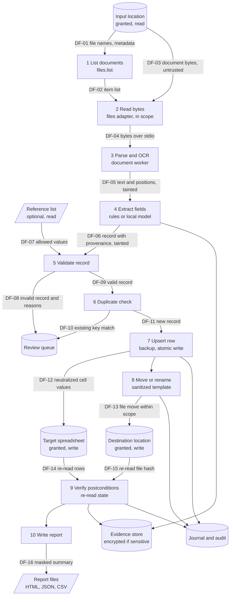
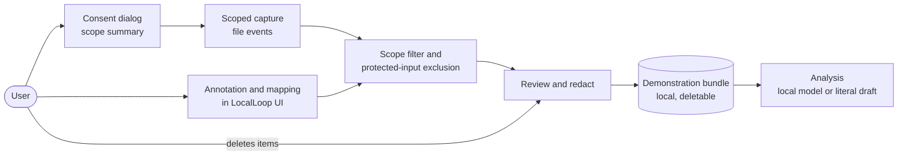
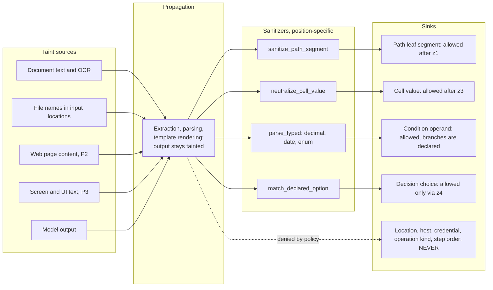
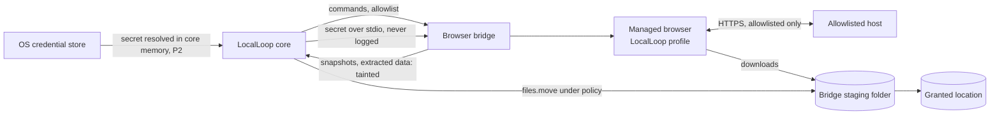

# LocalLoop — Data Flow

| Field | Value |
|---|---|
| Version | 0.1 (draft) |
| Date | 2026-10-09 |
| Parent | [SYSTEM_ARCHITECTURE.md](SYSTEM_ARCHITECTURE.md) |

> **Status:** Proposed design. Retention defaults below are proposals to confirm, not decisions.

This document details how data moves through LocalLoop: the MVP document-processing flow, recording, AI calls, and (Phase 2) browser flows. It also specifies data classification handling, **taint propagation**, and the data lifecycle. Classification levels are defined in [SRS §8.1](../requirements/SRS.md#81-data-inventory-and-classification).

---

## 1. MVP Document Workflow (DFD level 1)

### 1.1 Flow catalogue

| Flow | Data | Classification | Tainted | Protection |
|---|---|---|---|---|
| DF-01 | File names and metadata in the input location | Internal | Yes (names are attacker-controllable) | Scope check; names never used as paths without canonicalization |
| DF-03 | Document bytes | Sensitive | Yes | Read only inside granted scope; size limit |
| DF-04 | Bytes sent to worker | Sensitive | Yes | Stdio only; worker has no file or network access by design |
| DF-05 | Extracted text with coordinates | Sensitive | Yes | Kept in memory; stored as evidence only per retention |
| DF-06 | Typed record + provenance | Sensitive | Yes | Field-level sensitivity tags from the record schema |
| DF-08 / DF-10 | Items for review | Sensitive | Yes | Review UI shows values as plain text |
| DF-12 | Cell values | Sensitive | Yes | Formula neutralization; typed conversion (FR-063) |
| DF-13 | File move | Internal | Path segments derived from tainted values | Sanitized segment + canonicalization + handle check (FR-065, FR-105) |
| DF-14 / DF-15 | Observed state | Internal | No (observed by LocalLoop) | Read-only observers |
| DF-16 | Report | Sensitive (masked by default) | Contains tainted values | Masking of *sensitive* fields; HTML-escaped output |

---

## 2. Recording Data Flow (MVP)

Data never captured: events outside the selected folders, protected inputs (FR-018), and file contents other than the samples the user chose to annotate.

---

## 3. AI Data Flow and Minimization

| AI task | What is sent to the model | What is never sent | What is stored |
|---|---|---|---|
| Demonstration analysis (AI-01) | Objective, event list with redacted values, field annotations (names, types, sample values) | Secrets, protected inputs, unrelated documents | Inference record; proposal (as evidence, per retention) |
| Field extraction (AI-03) | Text of the current document (or the pages the template names), field schema | Other documents, previous items' values | Inference record; extracted record with provenance |
| Decision (AI-04) | Declared options, validated record fields relevant to the decision, short excerpt if the decision declares it | Secrets, unrelated fields marked *sensitive* unless the decision declares them | Decision + inference record |
| Explanation (AI-06) | Factor values, step names | Document content | Rendered text |

Prompts are built from templates whose untrusted slots are delimited and labelled as data (AIC-03). Prompts are not stored by default when they contain *sensitive* values; the inference record stores template ID, version, and hashes instead (AIC-07).

---

## 4. Taint Propagation

Rules:

1. Every value from a source in the diagram is wrapped as `Tainted<T>` (component-design §3.1).
2. Sanitizers produce values valid only for their sink position; a sanitized path segment is not acceptable as a host, for example.
3. The policy engine checks taint per parameter position (FR-106; full table in [security-architecture.md §6](security-architecture.md#6-prompt-injection-and-untrusted-content-defence)).
4. Taint never "washes out" through the model: model output is itself a taint source.

---

## 5. Browser Data Flow (Phase 2; MVP only if D-02)

The bridge writes only to its staging folder. Files reach user folders only through a policy-checked `files.move`.

---

## 6. Data Lifecycle and Retention

| Data | Created | Used | Retention default (proposed) | Deletion |
|---|---|---|---|---|
| Raw recording | Recording session | Analysis | Kept until the workflow is created, then 30 days (configurable) | User delete (FR-027) or retention cleanup |
| Workflow versions | Save, import, revert | Execution, history | Until the workflow is deleted | User delete; exported copies are the user's |
| Run records (steps, outcomes) | Each run | History, audit | 1 year (configurable) | Retention cleanup |
| Evidence (values, page images) | Runs | Review, reports | 90 days (configurable) | FR-120 |
| Audit chain | Security events | Verification | Until the user deletes all data | Only via full data reset (logged as a new chain start) |
| Reports | Run end | User | User-managed (in their folders) | User |
| Inference records | Each AI call | Provenance | Same as run records; outputs per evidence retention | Retention cleanup |
| Backups | User action | Restore | User-managed | User |

Deleting data removes rows and files; it does not guarantee physical erasure on SSDs (NFR-023), and the UI says so.

---

## 7. External Data Flows

Only these flows can leave the device, and only through approved workflow steps:

| Flow | Release | Control |
|---|---|---|
| Browser navigation and requests to allowlisted hosts | MVP if D-02, else P2 | FR-074 |
| Form submissions and uploads | P2 | `external_send` approval (FR-099) |
| User-initiated export or backup to a chosen location (possibly a synced folder) | MVP | User action; exports exclude secrets and evidence by default (FR-007) |

There is no telemetry, crash upload, or update check by default (FR-117).
