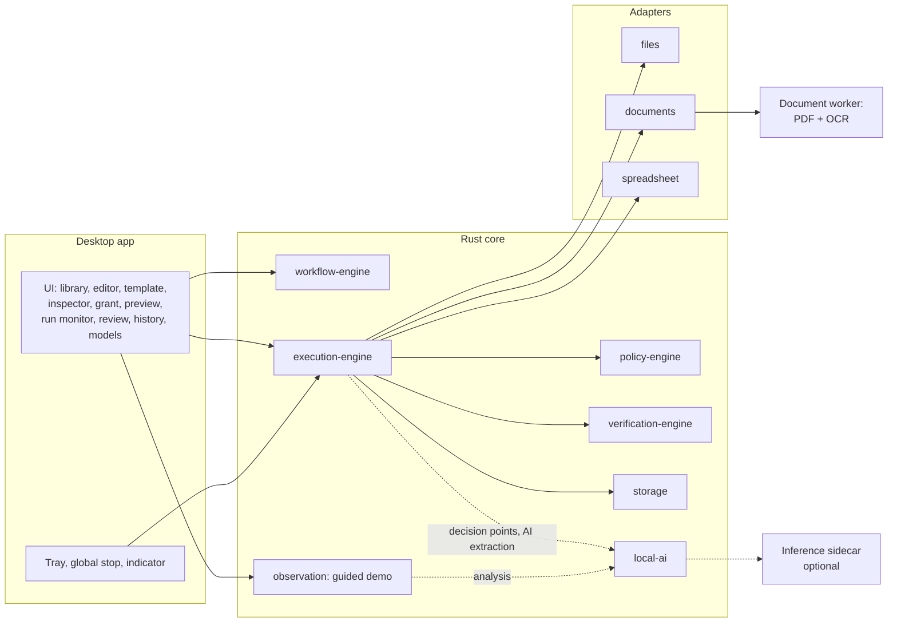

# LocalLoop — MVP Scope

| Field | Value |
|---|---|
| Version | 0.1 (draft) |
| Date | 2026-10-09 |
| Related | [SRS §20](../requirements/SRS.md#20-mvp-boundaries-and-deferred-features) · [Roadmap](ROADMAP.md) · [Backlog](BACKLOG.md) |

> **Status:** Proposed scope. Items marked *decision* need the project owner's confirmation (D-01, D-02).

---

## 1. MVP Statement

LocalLoop's MVP lets an office worker turn a recurring **document-processing task** into a verified, reusable automation that runs entirely on their laptop:

**Receive documents → Extract information → Validate data → Update a local spreadsheet → Organize files → Generate an execution report** (P§12).

It must be useful **without any AI model** (rule-based extraction for consistent layouts) and better **with a small local model** (AI-assisted setup, variable layouts, decision points). It must never report success it has not verified.

**Target user for MVP evaluation:** an individual or small-business staff member who processes recurring documents such as supplier invoices, receipts, or delivery forms, on an ordinary 8 GB Windows or macOS laptop.

## 2. Reference Scenario

*Every week, supplier invoices (PDF, some scanned) arrive in an "Invoices Inbox" folder. Each must be logged in `Invoices.xlsx` (vendor, invoice number, date, currency, subtotal, tax, total), checked (total = subtotal + tax; date not in the future; invoice number not already logged), and filed as `Processed/<Vendor>/<YYYY-MM>/<Vendor>_<InvoiceNo>.pdf`. Problem invoices go to a "Needs Review" folder, and a summary report is produced.*

| Stage | What LocalLoop does | Operations | Needs local AI? | Deterministic path | Failure handling |
|---|---|---|---|---|---|
| 1 Receive | List supported files in the bound *inbox* location | `files.list`, `control.for_each` | No | Always | Unsupported files reported (EXC-02) |
| 2 Extract | Read text layer or OCR; extract fields | `docs.read_text`, `extract.fields` | Optional | Rules (anchors, patterns, regions) for known layouts | Missing field → review (EXC-05); low OCR confidence → review (EXC-04) |
| 2a Classify (Adaptive only) | Choose which supplier template or rule set applies | `control.decide` | Yes (or user decides) | Explicit rule on vendor name when reliable | Escalation (EXC-18); manual fallback |
| 3 Validate | Required fields, types, arithmetic, date range, duplicates, reference list | `validate.record` | No | Always | Review queue (EXC-06, EXC-07) |
| 4 Update spreadsheet | Upsert row by invoice number | `sheet.upsert_rows` | No | Always | Lock wait (EXC-08); structure mismatch stops run (EXC-09); backup + atomic write |
| 5 Organize | Move and rename into dated vendor folder | `files.move` | No | Always | Collision policy (EXC-10); scope enforcement (EXC-11) |
| 6 Report | HTML + JSON + CSV summary with provenance | `report.write` | No | Always | Run outcome reflects verified state only |

## 3. Minimum Components

| Component | Why it is needed for the MVP | Can be fully deterministic? |
|---|---|---|
| UI (subset of screens) | Create, inspect, grant, preview, run, review | Yes |
| workflow-engine | Model, compiler, planner, templates, conditions, mode rules | Yes |
| policy-engine | Scopes, taint, approvals: safety cannot be deferred | Yes |
| execution-engine | Orchestration, journal, pause/stop, decision points | Yes (decision points use AI or the user) |
| verification-engine | Postconditions, outcomes, rollback | Yes |
| observation (guided demo) | Consent, file events, annotation, mapping | Yes |
| storage | Versions, runs, journal, audit chain, evidence | Yes |
| adapters: files, documents, spreadsheet | The actual work | Yes |
| document worker | Isolated parsing and OCR | Yes (OCR is a traditional model, not an LLM) |
| local-ai + inference sidecar | AI-assisted creation, variable-layout extraction, decision points | No; optional at runtime |

**Not needed for the MVP:** browser bridge (unless D-02), desktop adapter, screen capture, VLM, multi-run concurrency, any cloud service.

## 4. Local AI in the MVP

| Feature | Needs local AI | Without a model |
|---|---|---|
| Template-based workflow creation | No | Works |
| Guided demonstration capture | No | Works |
| Demonstration → proposed workflow (AI-01) | Yes | Literal draft from captured events; author edits (FR-032) |
| Variable and rule suggestions (AI-02) | Yes | Author defines variables and rules manually |
| Rule-based extraction | No | Works |
| Variable-layout extraction (AI-03) | Yes | Items rules cannot handle go to review |
| Mode recommendation | No (rule-based) | Works; AI-derived signals marked unknown |
| Decision points (AI-04) | Yes | User makes each decision (FR-051) |
| Validation, spreadsheet, files, report, verification | No | Works |
| Explanations (AI-06) | Optional | Template text |

**If the model becomes unavailable mid-run** (crash, memory pressure): the current inference step fails with EXC-15/EXC-16; the item follows its error rule (default: review) or the decision falls back to the user. Model-free steps and workflows are unaffected (FR-111).

## 5. Build Order: Deterministic First

1. **Model-free vertical slice (M1.3):** template → rules → validate → spreadsheet → organize → report, with policy, verification, journal, pause/stop. This alone is a usable product for consistent layouts.
2. **Guided demonstration (M1.4):** recording without AI; literal drafts.
3. **AI layer (M1.5):** registry, supervisor, extraction, analysis, decision points, plus the prompt-injection corpus and EV-02/EV-03 measurements.
4. **Hardening (M1.6):** fault injection, reliability runs, offline install, accessibility, release.

This order means the MVP still delivers value if the AI evaluations show weaker results than hoped. In that case, AI features ship as *experimental* or are deferred, and the requirements stay *Unvalidated*.

## 6. Scope

### 6.1 In the MVP

- Windows (x64) and macOS (Apple silicon) desktop app (A-01).
- Workflow library, editor, templates, versioning, export/import, inspection (FR-001 to FR-014).
- Guided demonstration recording with consent, scope, review/redaction (FR-015 to FR-022, FR-027).
- AI-assisted workflow creation (FR-028 to FR-030, Unvalidated) with a model-free fallback (FR-032).
- Preview validation (FR-034); mode recommendation and selection (FR-035 to FR-041).
- Exact Replay (FR-042 to FR-046); Adaptive Execution limited to decision points (FR-047 to FR-051, Unvalidated).
- Document processing: PDF and image intake, text layer, local OCR, rules, optional model extraction, validation, review queue, spreadsheet upsert (XLSX, CSV), file organization, reports, duplicate protection (FR-054 to FR-067).
- Verification, outcomes, retries, rollback, crash recovery, history, audit chain, redaction (FR-085 to FR-095).
- Progress, pause, emergency stop, approvals, indicator (FR-096 to FR-101).
- Permission manifest, grants, closed catalog, canonicalization, taint, revocation (FR-102 to FR-107).
- Local model registry and lifecycle (FR-108 to FR-113).
- Offline operation, no accounts, network transparency, offline installer (basic), backup, retention (FR-114 to FR-120).

### 6.2 Conditional (decision D-02)

- Basic browser interaction in a managed profile: open, navigate, click, fill non-secret fields, download (FR-068, FR-069, with FR-074 and FR-076). **Recommendation:** include only if the EV-09 packaging spike succeeds by the end of M1.0; otherwise move to Phase 2 without delaying the MVP.

### 6.3 Not in the MVP

Browser recording, credentials, adaptive browser execution, recovery proposals (Phase 2); native app automation, screen capture, OCR on screens, VLM (Phase 3); signed releases and offline updates, OS-level sandboxing of workers, broad template library (Phase 4); permanent delete operations, payments, messaging, and any arbitrary command execution (never planned without an ADR).

## 7. Realistic MVP Limitations

These limitations are stated honestly in the release notes and UI:

1. **Spreadsheets** are changed as files. Workbooks with macros, pivot tables, external links, or complex formatting may not be supported (A-05, EV-04). The spreadsheet must be closed while a run writes to it (Excel holds file locks on Windows).
2. **Document layouts:** rule-based extraction works for consistent layouts. Variable layouts need a model and still route uncertain items to review. No accuracy figure is claimed before EV-02.
3. **OCR quality** depends on scan quality and language support of the chosen engine (EV-06). Handwriting is out of scope.
4. **AI on 8 GB machines:** only small quantized models are realistic; AI features may be slower and less accurate than cloud models. Basic Automation is the guaranteed baseline (NFR-008).
5. **One run at a time** (A-07). No scheduling or folder watching in the MVP; runs start on demand.
6. **Single user**, no roles or accounts (A-06).
7. **English UI** (A-02).
8. **No remote websites** unless D-02 includes basic browser support, and even then no automated sign-in.
9. **Security:** the document worker is process-isolated but not OS-sandboxed; local malware running as the user is out of scope.

## 8. Reconciling the Proposal (D-01)

The proposal's MVP list (P§12) includes AI-assisted creation, mode selection, and basic browser interaction, which its roadmap (P§11) places in Phase 2. The SRS resolves this as: **MVP = Phase 1 + a constrained Phase 2 slice** (AI-assisted creation for the document workflow, mode recommendation, Adaptive Execution limited to decision points), with browser interaction conditional on D-02. See [SRS §20.4](../requirements/SRS.md#204-reconciling-the-proposals-mvp-list-and-roadmap-d-01).

## 9. Reference Dataset (Synthetic)

Development and evaluation use **synthetic** documents only (A-19), stored under `tests/fixtures/` once created:

| Set | Content | Purpose |
|---|---|---|
| F1 Consistent layouts | 3 fictitious vendors × 20 text-layer invoices each, generated from templates | Rule-based extraction, NFR-001 reliability runs |
| F2 Scanned variants | F1 subset printed to images with noise, skew, and compression | OCR, EXC-04 |
| F3 Variable layouts | 10+ layout variants per vendor | EV-02 model extraction, decision points |
| F4 Invalid documents | Wrong totals, missing fields, future dates, duplicates | Validation and review |
| F5 Adversarial | Prompt-injection text, path traversal names, formula payloads, malformed PDFs | NFR-020, FR-063, FR-065 |
| F6 Spreadsheets | Plain XLSX, CSV, workbook with formatting, locked file scenario | EV-04, FR-063 |

All vendor names and values are fictitious and generated; no real company's documents or branding are used.

## 10. MVP Demonstration Script (for reviews)

1. Disable networking on the laptop. Show it is offline.
2. Create the workflow from the template; show the permission manifest and preview (no file changes, hashes unchanged).
3. Accept the Exact Replay recommendation and its explanation; grant permissions.
4. Run on 20 mixed invoices: watch progress, see 2 invalid invoices routed to review, open the report.
5. Correct one review item and re-submit; reject the other.
6. Press the emergency stop during a second run; show the classified outcome and resume.
7. Show the audit chain verification.
8. (With a model installed) Run the adaptive version on variable layouts; show a decision escalated to the user because the consistency check disagreed.
9. Remove the model; show the model-free workflow still runs.

## 11. Exit Criteria

The MVP is releasable when the criteria in [SRS §19.2](../requirements/SRS.md#192-mvp-release-acceptance-criteria) (MVP-AC-01 to MVP-AC-07) are met on both reference machines.
