# LocalLoop — Development Roadmap

| Field | Value |
|---|---|
| Version | 0.1 (draft) |
| Date | 2026-10-09 |
| Related | [Proposal §11](../proposal/LocalLoop-Proposal.md) · [SRS](../requirements/SRS.md) · [MVP Scope](MVP_SCOPE.md) · [Backlog](BACKLOG.md) · [Traceability](../requirements/requirements-traceability.md) |

> **Status:** Plan, not a commitment. Phases are sequenced by **exit criteria, not dates** (A-15): "Each phase must meet measurable reliability criteria before the supported task scope expands" (P§11). Only Phase 1 (the MVP) is a commitment; later phases are subject to Phase 1 results and user validation.

The SRS explains *what* LocalLoop must do; the architecture explains *how*; this roadmap explains **in what order it is built and validated**.

**Active validation scope (2026-10-10):** Windows is the milestone gate; macOS is deferred by the owner ([ADR-0010](../adr/0010-windows-first-validation.md)). The original cross-platform MVP release criteria below remain unverified. EV-01 is deferred to M1.5, EV-09 to Phase 2, and unavailable 8 GB reference-machine acceptance remains a release follow-up rather than a claimed result.

---

## 1. Overview

```mermaid
flowchart LR
    subgraph p1 ["Phase 1: Core Automation Foundation, MVP"]
        m10["M1.0 Foundation<br/>and spikes"]
        m11["M1.1 Core domain"]
        m12["M1.2 Adapters and<br/>verification"]
        m13["M1.3 Model-free<br/>end-to-end"]
        m14["M1.4 Guided<br/>demonstration"]
        m15["M1.5 Local AI slice"]
        m16["M1.6 Hardening and<br/>MVP release"]
    end
    subgraph p2 ["Phase 2: Browser Automation and Workflow Intelligence"]
        m21["M2.1 Browser bridge"]
        m22["M2.2 Browser recording<br/>and interactions"]
        m23["M2.3 Adaptive browser<br/>execution"]
        m24["M2.4 Validation studies"]
    end
    subgraph p3 ["Phase 3: Desktop Vision and Application Support"]
        m31["M3.1 Accessibility adapters"]
        m32["M3.2 Desktop recording"]
        m33["M3.3 Screen understanding"]
        m34["M3.4 Local VLM, optional"]
    end
    subgraph p4 ["Phase 4: Reliability, Optimization, Production Readiness"]
        m41["M4.1 Low-memory optimization"]
        m42["M4.2 Templates and app coverage"]
        m43["M4.3 Security hardening"]
        m44["M4.4 Production readiness"]
    end

    m10 --> m11 --> m12 --> m13 --> m14 --> m15 --> m16
    m10 -.->|"D-02: browser deferred"| m21
    m16 --> m21 --> m22 --> m23 --> m24
    m24 --> m31 --> m32 --> m33 --> m34
    m16 --> m41
    m24 --> m42
    m33 --> m43 --> m44
    m41 --> m44
    m42 --> m44
```

| Phase | Goal | Release |
|---|---|---|
| 1 | A verified, offline, model-optional document workflow automation app | **MVP** |
| 2 | Browser automation and AI-assisted workflows on the web, validated with users | v-next |
| 3 | Native application automation with structural-first, vision-fallback interaction | Later |
| 4 | Production quality: performance, coverage, security hardening, deployment | 1.0 |

**Phase 1 includes a constrained slice of the proposal's Phase 2** (AI-assisted creation, mode recommendation, decision-point Adaptive Execution), as resolved in [SRS §20.4](../requirements/SRS.md#204-reconciling-the-proposals-mvp-list-and-roadmap-d-01) (D-01).

---

## 2. Phase 1 — Core Automation Foundation (MVP)

**Goal (P§11 Phase 1):** desktop interface, local storage, workflow schema, file automation, execution engine, verification; Exact Replay and basic recording for a narrow task set, plus the MVP AI slice.

### Milestones and deliverables

| Milestone | Deliverables | Key requirements |
|---|---|---|
| **M1.0 Foundation and spikes** | Cargo workspace and crate skeletons; Windows Tauri + React shell; CI for Rust/TS (format, lint, test, audit, forbidden-dependency check); Windows spikes EV-04 (XLSX), EV-06 (OCR), encryption at rest (D-07), child lifecycle; synthetic fixture generator (F1–F6); development-machine shell baseline with reference-machine acceptance pending. EV-01 moves to M1.5; EV-09 to Phase 2; macOS deferred | NFR-008, NFR-013, NFR-018, NFR-030, NFR-033 |
| **M1.1 Core domain** | Workflow model + JSON Schema 0.1 finalized; compiler; planner and plan hash; conditions and templates; path sanitizer; policy engine with `AuthorizedOperation`; canonicalization; taint types; storage with migrations, journal, audit chain, encryption at rest | FR-002, FR-003, FR-011, FR-031, FR-033, FR-065, FR-077, FR-094, FR-095, FR-102, FR-104 to FR-106, NFR-005, NFR-017, NFR-029, NFR-032 |
| **M1.2 Adapters and verification** | Files adapter; document worker (PDF text, render, OCR); spreadsheet adapter with write safety; extraction rules; validation rules; provenance; verification engine with MVP postconditions and outcome classifier | FR-054 to FR-057, FR-059, FR-060, FR-062 to FR-064, FR-085 to FR-087, NFR-031 |
| **M1.3 Model-free end-to-end** | Execution engine (Exact Replay, retries, rollback, crash recovery, pause/stop, approvals, single run); mode recommender (rules); UI: library, template, editor, inspector, grant, preview, run monitor, review queue, history, reports; tray and global stop; external-service labels | FR-001, FR-004 to FR-010, FR-012 to FR-014, FR-034 to FR-045, FR-061, FR-066, FR-067, FR-088 to FR-093, FR-096 to FR-101, FR-103, FR-107, FR-116, NFR-004, NFR-009, NFR-011, NFR-012, NFR-014, NFR-024 |
| **M1.4 Guided demonstration** | Recorder sessions with consent hash, indicator, scope filter, file events, annotation, spreadsheet mapping, review/redaction, retention; literal drafts | FR-015 to FR-022, FR-027, FR-032, NFR-022 |
| **M1.5 Local AI slice** | Model registry, resource guard, supervisor, prompt templates, structured outputs; AI-assisted analysis, variable detection, model extraction, decision points with consistency checks, budgets, manual fallback; prompt-injection corpus; EV-02 and EV-03 reports | FR-023, FR-028 to FR-030, FR-046 to FR-051, FR-058, FR-108 to FR-113, NFR-010, NFR-020, NFR-035 |
| **M1.6 Hardening and MVP release** | Fault-injection and mismatch-injection suites; reliability runs (≥100 per machine); offline acceptance suite and network monitoring; offline installer (basic); backup/restore; retention; accessibility pass; error-message review; usability check of mode explanations (EV-07); user documentation; release notes listing limitations and unvalidated features | FR-114, FR-115, FR-117 to FR-120, NFR-001 to NFR-003, NFR-006 to NFR-008, NFR-015, NFR-021, NFR-023, NFR-025 to NFR-028, NFR-036 |

### Dependencies

- Reference machines available (8 GB Apple silicon; 8 GB Windows x64) (A-14).
- Spike results before dependent work: EV-06 before the document worker's OCR; EV-04 before the spreadsheet adapter; EV-01 at the start of M1.5; D-07 before storage encryption; EV-09 before the Phase 2 browser bridge (D-02 deferral confirmed).
- Synthetic fixture sets F1–F6 before M1.2 tests.

### Risks

| Risk | Impact | Mitigation |
|---|---|---|
| XLSX round-trip damages formatting (A-05) | Integrity concerns, trust | EV-04 first; backups; reject unsupported workbooks; CSV and separate-sheet options |
| Small models underperform (AR-01) | AI features weak | Model-free slice ships first; AI features labelled experimental if EV-02/EV-03 miss targets |
| Packaging sidecars on two OSes takes longer than expected | Schedule | Packaging spike in M1.0; per-OS CI builds early |
| OCR accuracy on low-quality scans | Many review items | Review queue as the designed path; EV-06 picks engine with fixtures |
| Scope creep from browser support (D-02) | MVP delay | Browser and EV-09 deferred to Phase 2 |
| Solo or small team capacity (A-15) | Slower progress | Milestones are independently demonstrable; M1.3 is already useful |

### Exit criteria (MVP release gate)

1. MVP-AC-01 to MVP-AC-07 ([SRS §19.2](../requirements/SRS.md#192-mvp-release-acceptance-criteria)) met on both reference machines.
2. NFR-001 ≥ 99% observed success over ≥ 100 runs per machine on the reference suite, reported with sample size.
3. NFR-002, NFR-003: zero undetected integrity faults; 100% of injected critical mismatches detected.
4. NFR-006/NFR-007: offline suite passes with no unexpected network connections.
5. NFR-020: zero policy bypasses on the prompt-injection corpus.
6. EV-02 and EV-03 reports published, whether or not the targets were met.
7. Security review gate passed ([security-architecture.md §17](../architecture/security-architecture.md#17-security-review-gates)).

---

## 3. Phase 2 — Browser Automation and Workflow Intelligence

**Goal (P§11 Phase 2):** supported browser automation, AI-assisted workflow construction, variable detection, and Smart Execution Mode Selection on the web; Adaptive Execution for a constrained set of browser workflows.

| Milestone | Deliverables | Key requirements |
|---|---|---|
| **M2.1 Browser bridge** | Node + Playwright bridge packaged offline; managed profile; basic operations; host allowlist in core and bridge; challenge detection | FR-068, FR-069, FR-074, FR-076 |
| **M2.2 Browser recording and interactions** | Recorder in managed profile with semantic descriptors; semantic targeting; dropdowns, tables, dynamic content, uploads; page extraction; submission verification; credential references; authorized-window screenshots | FR-024, FR-026, FR-070 to FR-073, FR-075 |
| **M2.3 Adaptive browser execution** | Observe → propose → check → act → verify loop with fixed vocabulary; snapshot-bound URLs; optional non-GET request gating (evaluated); recovery proposals from declared options | FR-052, FR-053 |
| **M2.4 Validation studies** | EV-08 productivity study (≥ 30% target) on real task samples with consent; EV-07 usability follow-up; competitive comparison against existing tools (P§10); decision on Phase 3 scope | NFR-034, NFR-025 |

**Dependencies:** MVP released; EV-09 packaging solution; local fixture websites for testing; prompt-injection corpus extended with web pages; recruited representative users for EV-08.

**Risks:** website changes and anti-automation measures (mitigate with semantic targeting, verification, pausing on challenges, and clear user responsibility for terms of service); approval fatigue for submissions (minimize and group approvals); larger installer (keep browser support an optional component).

**Exit criteria:**
1. Browser fixture suite: ≥ 99% success for validated Exact Replay browser workflows (same protocol as NFR-001).
2. Zero policy bypasses on the web prompt-injection corpus; zero navigations outside allowlists.
3. Adaptive browser workflows: success and escalation rates reported per task on held-out pages; scope limited to tasks meeting a target agreed before measurement.
4. EV-08 results published. If the productivity target is not met, Phase 3 is re-planned around the findings rather than started as written.

---

## 4. Phase 3 — Desktop Vision and Application Support

**Goal (P§11 Phase 3):** native application integration with accessibility interfaces, OCR, and selected local vision-language models; observe-act-verify interaction with controlled recovery.

| Milestone | Deliverables | Key requirements |
|---|---|---|
| **M3.1 Accessibility adapters** | Platform layer for UIA and AX; invoke/value/selection/toggle patterns; application support registry with tested capabilities; OS permission flows | FR-078 to FR-080 |
| **M3.2 Desktop recording** | Scoped desktop capture via accessibility events; keyboard capture limited to selected apps; secure-field exclusion; authorized-window screenshots | FR-025, FR-026 |
| **M3.3 Screen understanding** | Tiered inspection (structural → OCR/CV); observe-act-verify; expected-effect checks; uncertain-target handling; window-identity checks before input; failsafe evaluation | FR-081 to FR-083 |
| **M3.4 Local VLM (optional)** | VLM integration at Enhanced level only, if EV-05 passes | FR-084 |

**Dependencies:** EV-05 accessibility coverage study across candidate applications; Phase 2 adaptive loop design reused for desktop; selected target applications agreed with users from M2.4.

**Risks:** inconsistent accessibility support across apps (registry marks tested capabilities only); input injection safety (window checks, stop, verification); VLM memory needs beyond 8 GB (Enhanced level only, never required).

**Exit criteria:**
1. Each registered application passes its capability test suite on both OSes where applicable.
2. No input delivered to a non-granted window in the focus-change test suite.
3. Structural inspection handles targets in registered apps without OCR/VLM in the majority of steps (measured; target set at phase start).
4. VLM feature shipped only if EV-05 shows acceptable accuracy and memory on Enhanced hardware.

---

## 5. Phase 4 — Reliability, Optimization, and Production Readiness

**Goal (P§11 Phase 4):** performance on low-memory hardware, broader templates, more supported applications, stronger backup, security, testing, and deployment.

| Milestone | Deliverables | Key requirements |
|---|---|---|
| **M4.1 Low-memory optimization** | Memory and startup profiling; model unload tuning; smaller default models; regression budgets enforced in CI on reference hardware | NFR-008, NFR-010 |
| **M4.2 Templates and app coverage** | Template library for common document workflows; additional registered applications; template validation suite | FR-013, FR-080 |
| **M4.3 Security hardening** | OS-level sandboxing of document worker and bridge; code signing and notarization; signed offline updates; encrypted backups; audit checkpoint export; external security review | NFR-019, FR-119, AR-05, AR-07 |
| **M4.4 Production readiness** | Full offline installer with model packages; installer and upgrade tests; user and admin documentation; support process; licence decision implemented (D-03) | FR-118, NFR-036 |

**Exit criteria:** signed installers verified on clean machines; upgrade from every previous release without data loss; security review findings resolved or accepted with rationale; regression budgets met on reference machines.

---

## 6. Phase Gates

| Gate | Evidence required |
|---|---|
| Start Phase 1 | D-01 confirmed; reference machines available; this documentation reviewed |
| M1.0 → M1.1 (active Windows gate) | Windows checks and reports EV-04, EV-06, LL-010, LL-011, LL-013; proposed ADRs for OCR (D-04), XLSX (A-05), and encryption (D-07); owner milestone review. EV-01 deferred to M1.5, EV-09/browser to Phase 2; macOS and 8 GB reference-machine acceptance explicitly pending (ADR-0010) |
| MVP release | Phase 1 exit criteria |
| Start Phase 3 | Phase 2 exit criteria, including EV-08 findings |
| 1.0 release | Phase 4 exit criteria |

## 7. Initial Backlog

Issue-sized tasks for all phases, with dependencies and linked requirements: [BACKLOG.md](BACKLOG.md).
