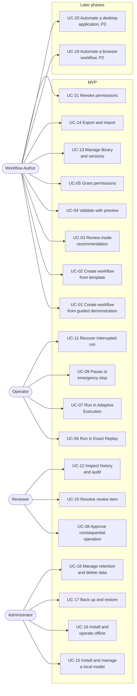

# LocalLoop — Use Cases

| Field | Value |
|---|---|
| Version | 0.1 (draft) |
| Date | 2026-10-09 |
| Related | [SRS](SRS.md) · [Traceability](requirements-traceability.md) |

Actors are the user classes from [SRS §3.2](SRS.md#32-user-classes): **Workflow Author (USR-1)**, **Operator (USR-2)**, **Reviewer (USR-3)**, **Administrator (USR-4)**. In the MVP these are usually one person. Secondary actors: **Local model** (untrusted advisor), **Operating system**, **Remote website** (P2+).

Exceptional conditions (`EXC-nn`) are defined in [SRS §17](SRS.md#17-error-handling-and-exceptional-conditions).

## Use case overview

---

## UC-01 — Create a workflow from a guided demonstration

| Item | Detail |
|---|---|
| Primary actor | Workflow Author |
| Release | MVP |
| Requirements | FR-001, FR-015 to FR-022, FR-027 to FR-033 |
| Preconditions | LocalLoop installed. Sample documents and target spreadsheet available. |
| Trigger | Author chooses *New workflow → Demonstrate*. |

**Main success scenario**

1. Author enters a name and objective (for example "Log supplier invoices into Invoices.xlsx and file the PDFs by vendor and month").
2. System proposes a recording scope (folders) and shows the consent summary: what is captured, from where, where it is stored.
3. Author adjusts the scope and confirms. System starts recording and shows the indicator.
4. Author moves and renames a sample invoice into the destination folder as they normally would.
5. Author opens the sample invoice in LocalLoop and marks fields: vendor, invoice number, date, total.
6. Author picks the target spreadsheet, sheet, and columns, and marks *invoice number* as the key column.
7. Author stops recording. System shows captured events and artifacts; author deletes an irrelevant event.
8. Author confirms analysis. System analyzes the demonstration with the local model and compiles a draft: list, read, extract, validate, upsert row, move/rename, report. Variables (vendor, number, date, total) are marked as inferred, with rationale.
9. Author reviews the draft, accepts inferred elements, and saves. Workflow is in state *Draft*.

**Alternative and exception flows**

- 3a. Author cancels consent → nothing is captured; session discarded.
- 4a. Author acts in an unselected folder → event not captured (FR-017).
- 5a. Sample is scanned → System runs local OCR to make text selectable; low confidence is flagged (EXC-04).
- 8a. No model installed or model fails (EXC-15, EXC-16) → System builds a literal draft from events with recorded values as constants (FR-032); author converts constants to variables in the editor.
- 8b. Analysis cannot decide whether a value is constant or variable → System asks for another example or an explicit answer (FR-023).
- 8c. Proposal contains an operation outside the catalog → compiler rejects that part; the draft shows the gap for manual completion (FR-031).

**Postconditions:** A Draft workflow version exists with a stored demonstration (subject to retention). No permission is granted yet.

---

## UC-02 — Create a workflow from a template or structured instruction

| Item | Detail |
|---|---|
| Primary actor | Workflow Author |
| Release | MVP |
| Requirements | FR-012, FR-013, FR-031, FR-033 |
| Preconditions | None (works with no model installed). |
| Trigger | Author chooses *New workflow → From template* or *Blank*. |

**Main success scenario**

1. Author selects the *Document intake to spreadsheet* template.
2. System creates a draft with symbolic locations (`inbox`, `processed`, `review`) and placeholder field definitions.
3. Author defines fields and extraction rules (anchors, patterns, regions), validation rules, spreadsheet mapping, and the file name template.
4. Editor validates each change inline; author saves. Workflow is in state *Draft*.

**Exceptions:** 4a. Invalid configuration → editor highlights the field with the compiler error; saving is blocked until fixed (FR-012).

**Postconditions:** A Draft version exists.

---

## UC-03 — Review the execution mode recommendation

| Item | Detail |
|---|---|
| Primary actor | Workflow Author |
| Release | MVP |
| Requirements | FR-035 to FR-041 |
| Preconditions | Draft workflow; at least one representative input selected for preview. |
| Trigger | Author opens *Mode* during validation. |

**Main success scenario**

1. System derives factor signals (sequence stability, input structure, unresolved decisions, exception coverage, preview result) and applies the recommendation rules ([SRS §13.2](SRS.md#132-recommendation-rules)).
2. System shows "Recommended: Exact Replay — your invoices share one layout and every step passed preview, so no AI decisions are needed while running."
3. Author accepts. System records recommendation, factors, and choice.

**Alternative flows**

- 2a. Rules recommend Adaptive Execution because supplier layouts vary and a "which template applies?" decision has no explicit rule; the explanation lists the decision point and what happens when the model is unsure.
- 3a. Author overrides to Exact Replay → compatibility check runs; if a decision point has no rule or user fallback, System explains and blocks validation until the author adds a rule or a user-decision fallback (FR-038).
- 3b. No model installed and rules would recommend Adaptive Execution → System recommends Exact Replay with review routing and explains why (rule 4).

**Postconditions:** Mode selected and recorded; validation can proceed.

---

## UC-04 — Validate a workflow with preview

| Item | Detail |
|---|---|
| Primary actor | Workflow Author |
| Release | MVP |
| Requirements | FR-033, FR-034, FR-011, NFR-005 |
| Preconditions | Draft with success conditions; mode selected. |
| Trigger | Author chooses *Preview*. |

**Main success scenario**

1. Author selects representative input documents.
2. System runs the workflow in preview mode: reads and extracts for real, simulates writes.
3. System shows planned changes: rows to add or update (with values and provenance), files to move or rename (old → new path), report to write, items that would go to review, and the plan hash.
4. Author accepts the preview. Version becomes *Validated*.

**Exceptions:** 3a. Validation failures or unsupported files → listed per item; author edits the workflow (back to UC-02 step 3) or accepts that those items will go to review.

**Postconditions:** Version is *Validated*; no file or spreadsheet changed (verified by hash in tests).

---

## UC-05 — Grant permissions

| Item | Detail |
|---|---|
| Primary actor | Workflow Author |
| Release | MVP |
| Requirements | FR-010, FR-102, FR-103, FR-116 |
| Preconditions | Version is *Validated*. |
| Trigger | Author chooses *Approve for use*. |

**Main success scenario**

1. System shows the permission manifest in plain language: "Read from *inbox*", "Write to *processed* and *review*", "Modify *Invoices.xlsx*", operations used, and external services (none).
2. Author binds each symbolic location to a real folder or file.
3. System canonicalizes the bindings and warns about broad scopes (for example a whole drive).
4. Author grants. Version becomes *Approved*; grant is audit-logged.

**Exceptions:** 3a. A binding points inside a system folder or LocalLoop's own data folder → System refuses that binding.

**Postconditions:** Version is executable.

---

## UC-06 — Run a workflow in Exact Replay (MVP document scenario)

| Item | Detail |
|---|---|
| Primary actor | Operator |
| Release | MVP |
| Requirements | FR-042 to FR-045, FR-054 to FR-067, FR-085 to FR-089, FR-093, FR-096, FR-100 |
| Preconditions | Approved version; input documents in the bound input folder. |
| Trigger | Operator chooses *Run*. |

**Main success scenario**

1. System checks the grant matches the version's manifest and builds the plan. No consequential operations → no plan approval needed.
2. System shows the run indicator and progress.
3. For each document: read and parse (text layer or OCR) → extract fields → validate → duplicate check → upsert spreadsheet row (backup, atomic write, re-read) → move and rename the file → verify postconditions.
4. System evaluates workflow success conditions and writes the report (HTML, JSON, CSV).
5. Run outcome `completed`; history entry created.

**Alternative and exception flows**

- 3a. Document is encrypted (EXC-03), OCR is low confidence (EXC-04), a required field is missing (EXC-05), or validation fails (EXC-06) → item goes to the review queue; no spreadsheet write; run continues.
- 3b. Duplicate document or key (EXC-07) → duplicate policy applied.
- 3c. Spreadsheet is open in another application (EXC-08) → bounded retries, then run pauses and asks the operator to close the file.
- 3d. Destination name exists (EXC-10) → collision policy (`suffix` or `fail`); never overwrite.
- 3e. Postcondition fails (EXC-13) → rollback of the item if configured; item `failed`.
- 3f. Postcondition cannot be evaluated (EXC-14) → item `unverified` → review.
- 5a. Some items went to review → run outcome `partially_completed`.

**Postconditions:** Spreadsheet and files updated only for verified items; report written; every step recorded.

---

## UC-07 — Run a workflow in Adaptive Execution (decision points)

| Item | Detail |
|---|---|
| Primary actor | Operator; secondary: Local model |
| Release | MVP (constrained, Unvalidated — EV-03) |
| Requirements | FR-047 to FR-051, FR-110, FR-111 |
| Preconditions | Approved Adaptive version with a decision point, for example "Which supplier template applies?" with declared options. A model at the required level is installed. |
| Trigger | Operator chooses *Run*. |

**Main success scenario**

1. Execution proceeds as UC-06 until the decision point.
2. System asks the model to choose one declared option, given the item's validated data.
3. System validates the output, checks option preconditions, runs a consistency sample, and compares confidence with the threshold.
4. Checks pass → System executes the chosen option's steps, each authorized by the policy engine.
5. Decision is recorded with provenance.

**Alternative and exception flows**

- 3a. Invalid output (EXC-17), disagreement, unmet preconditions, or low confidence (EXC-18) → decision escalated; operator chooses; decision recorded as user-made.
- 2a. Model unavailable (EXC-15, EXC-16) → manual decision fallback for each decision point (FR-051).
- 4a. Decision budget exhausted (EXC-28) → run pauses for the operator.
- 4b. A step of the chosen option is denied by policy (EXC-19) → item `failed` with `policy_denied`.

**Postconditions:** As UC-06, with every decision recorded as model-made or user-made.

---

## UC-08 — Approve a consequential operation

| Item | Detail |
|---|---|
| Primary actor | Reviewer |
| Release | MVP (mechanism); P2 for `external_send` operations |
| Requirements | FR-099, FR-094 |
| Preconditions | A run reaches an operation requiring approval (author-marked step in MVP; for example a form submission in P2). |
| Trigger | System raises an approval request. |

**Main success scenario**

1. System pauses the item and shows the trusted approval dialog: operation in plain language, exact target, values (untrusted values marked), and the run and step it belongs to.
2. Reviewer approves.
3. System issues a single-use token bound to the operation hash; the operation executes once.

**Exceptions:** 2a. Reviewer rejects → operation skipped; item handled by its error rule (`approval_rejected`). 3a. Parameters changed after approval → hash mismatch; approval invalid; new approval required.

**Postconditions:** Approval or rejection recorded in the audit chain.

---

## UC-09 — Pause or emergency stop a run

| Item | Detail |
|---|---|
| Primary actor | Operator |
| Release | MVP |
| Requirements | FR-097, FR-098, FR-100, NFR-011, NFR-012 |
| Preconditions | A run is active. |
| Trigger | Operator presses *Pause*, *Stop*, the tray item, or the global shortcut. |

**Main success scenario (stop)**

1. System acknowledges stop; no new operation is dispatched.
2. In-flight cancellable operations are cancelled; others complete and are verified.
3. Run is classified with termination reason `user_stopped`; report written for processed items.

**Alternative flow (pause):** System stops at the next step boundary; operator resumes later from the same point.

**Postconditions:** State is known for every item; nothing runs after the acknowledgement.

---

## UC-10 — Resolve a review-queue item

| Item | Detail |
|---|---|
| Primary actor | Reviewer |
| Release | MVP |
| Requirements | FR-061, FR-059 |
| Preconditions | An item is in the review queue. |
| Trigger | Reviewer opens the review queue. |

**Main success scenario**

1. System shows the item: reason, document preview, extracted values with provenance, failed rules.
2. Reviewer corrects a value.
3. System re-validates; reviewer re-submits the item.
4. System runs the remaining steps for the item (as UC-06 step 3, from upsert onwards) with policy checks and verification.

**Alternative flows:** 2a. Reviewer rejects the item → item closed as `failed` with the reviewer's reason; file optionally moved to the *review* location.

**Postconditions:** Item resolved; corrections recorded as user-made.

---

## UC-11 — Recover an interrupted run

| Item | Detail |
|---|---|
| Primary actor | Operator |
| Release | MVP |
| Requirements | FR-090, FR-091, NFR-004 |
| Preconditions | LocalLoop or the machine stopped during a run (EXC-22). |
| Trigger | Next launch. |

**Main success scenario**

1. System scans the journal and finds steps with an intent but no result.
2. System re-observes those steps' targets (does the moved file exist at the destination? is the row present?) and classifies them.
3. System shows the interrupted run with item states and offers *Resume*, *Roll back interrupted items*, or *Close as is*.
4. Operator chooses *Resume*; System continues without repeating completed steps.

**Exceptions:** 2a. State cannot be determined → item `unverified` → review queue.

**Postconditions:** No duplicate rows or files; run outcome reflects verified state.

---

## UC-12 — Inspect run history and verify the audit log

| Item | Detail |
|---|---|
| Primary actor | Reviewer |
| Release | MVP |
| Requirements | FR-066, FR-093, FR-094, FR-095 |
| Preconditions | At least one run exists. |
| Trigger | Reviewer opens *History*. |

**Main success scenario**

1. Reviewer filters runs by workflow and outcome.
2. Reviewer opens a run: items, steps, policy decisions, approvals, decisions (model or user), evidence, and the report.
3. Reviewer chooses *Verify audit log*; System walks the hash chain and reports *intact* or the first broken entry.

**Postconditions:** None (read-only).

---

## UC-13 — Manage the library and versions

| Item | Detail |
|---|---|
| Primary actor | Workflow Author |
| Release | MVP |
| Requirements | FR-003 to FR-006, FR-009, FR-011, FR-012, FR-014 |
| Main scenario | Author searches the library, opens a workflow, edits a step (new Draft version; approval of the old version unaffected until the new one is approved), views version history, reverts to an earlier version (new Draft), duplicates a workflow (no grants copied), or archives one (blocked from running, history kept). |

---

## UC-14 — Export and import a workflow

| Item | Detail |
|---|---|
| Primary actor | Workflow Author |
| Release | MVP |
| Requirements | FR-007, FR-008, NFR-029 |

**Main success scenario**

1. Author exports a version; System writes JSON without secrets, grants, folder bindings, or evidence.
2. On another machine, author imports the file; System validates it against the schema version.
3. Imported workflow appears as *Draft* with no grants; author previews (UC-04) and grants (UC-05) before use.

**Exceptions:** 2a. Invalid or unsupported file (EXC-27) → import refused with the first failing field. 3a. The manifest requests broad scopes → warnings in the grant dialog.

---

## UC-15 — Install and manage a local model

| Item | Detail |
|---|---|
| Primary actor | Administrator |
| Release | MVP |
| Requirements | FR-108 to FR-113, NFR-010 |

**Main success scenario**

1. Administrator chooses *Add model* and selects a GGUF file or offline model package.
2. System computes SHA-256, reads metadata, compares with the package manifest, and records licence and capability level.
3. System runs a short local self-test and shows the resulting capability level.

**Exceptions:** 2a. Hash mismatch (EXC-15) → refused. 3a. Not enough memory (EXC-16) → model registered but marked *cannot load on this machine*; capability level unchanged.

---

## UC-16 — Install and operate offline

| Item | Detail |
|---|---|
| Primary actor | Administrator, Operator |
| Release | MVP (basic), P4 (full) |
| Requirements | FR-114 to FR-118, NFR-006, NFR-007, NFR-036 |

**Main success scenario**

1. Administrator runs the offline installer on a machine with no network; WebView runtime is installed from the package if missing (Windows).
2. First launch requires no sign-in or licence check.
3. Operator runs model-free and AI-assisted local workflows with networking disabled.
4. A workflow that depends on a remote site is labelled *external service*; running it offline fails clearly at that step (EXC-24).

---

## UC-17 — Back up and restore

| Item | Detail |
|---|---|
| Primary actor | Administrator |
| Release | MVP (Should), P4 (Must) |
| Requirements | FR-119 |
| Main scenario | Administrator creates a backup (workflows, versions, settings, optional history and evidence) to a chosen folder; restores it on a clean install; version hashes match; grants must be approved again. |

---

## UC-18 — Manage retention and delete data

| Item | Detail |
|---|---|
| Primary actor | Administrator |
| Release | MVP |
| Requirements | FR-027, FR-120, NFR-023 |
| Main scenario | Administrator sets retention periods for recordings and evidence, deletes evidence for a workflow, and deletes a recording. System removes rows and files and logs the deletion without the deleted content, noting that physical erasure on SSDs is not guaranteed. |

---

## UC-19 — Automate a browser workflow (Phase 2)

| Item | Detail |
|---|---|
| Primary actor | Workflow Author, Operator |
| Release | P2 (basic subset in MVP only if D-02) |
| Requirements | FR-024, FR-052, FR-068 to FR-076 |

**Main success scenario**

1. Author records a task in the managed browser: open a local or allowlisted supplier portal, filter invoices, download the PDFs.
2. System stores semantic element descriptors and the host allowlist; password fields become secret references.
3. Operator runs the workflow; downloads land in staging and are moved into the input location by policy-checked operations; UC-06 continues.

**Exceptions:** Host not allowlisted (EXC-19); session expired or challenge (EXC-26) → pause for the user; element changed (EXC-25) → error rule (Exact Replay) or re-observe within budget (Adaptive).

---

## UC-20 — Automate a native desktop application (Phase 3)

| Item | Detail |
|---|---|
| Primary actor | Workflow Author, Operator |
| Release | P3 |
| Requirements | FR-025, FR-077 to FR-084 |
| Main scenario | Author selects a registered application; System requests OS accessibility permission if needed; author demonstrates the task; System replays through UIA/AX elements, falling back to OCR/vision only when needed, verifying each action's effect; uncertain targets for consequential actions prompt the user. |

---

## UC-21 — Revoke permissions

| Item | Detail |
|---|---|
| Primary actor | Workflow Author |
| Release | MVP |
| Requirements | FR-107 |
| Main scenario | Author revokes a workflow's grant. If a run is active, it stops at the next step boundary with reason `permission_revoked`. The workflow returns to *Validated* and cannot run until granted again. |
